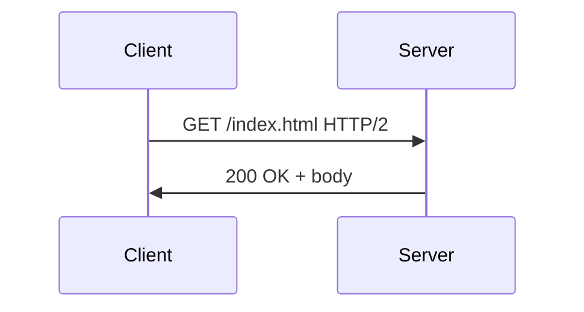

# Module 05 — Application Layer: HTTP & DNS

> **Agent spawn**: `@Memory.md` + `@Prompt.md` + this file + `@NOTES.md`
> **Nav**: ← [04 Transport TCP/UDP](../04-transport-tcp-udp/MODULE.md) · Next → [06 TLS & Security](../06-tls-security/MODULE.md)

## At a glance
| | |
|---|---|
| Prerequisites | 04 |
| Duration | ~2 sessions |
| Exit test | idempotent vs safe + status families + HTTP 1/2/3 |

## Visual map
```
HTTP/1.1: 1 request per connection at a time (keep-alive) → HOL blocking
HTTP/2  : multiplexed streams over 1 TCP conn (HPACK) → but TCP HOL remains
HTTP/3  : QUIC over UDP → per-stream, no TCP HOL, faster handshake

Methods: GET(safe) POST PUT(idempotent) PATCH DELETE(idempotent)
Status: 1xx info 2xx ok 3xx redirect 4xx client 5xx server
```

**Mental model**: HTTP = request/response text protocol over TCP (3 = over QUIC/UDP). Idempotent = same request N baar = same effect (PUT/DELETE), safe = no change (GET). HTTP/2 multiplexing HTTP/1.1 ka HOL fix karta par TCP-level HOL HTTP/3 hi hatata.

**Redraw challenge**: HTTP/1.1 vs 2 vs 3 connection model.

## Objectives
1. HTTP methods + idempotency/safety + status codes
2. Headers, cookies/sessions
3. HTTP/1.1 vs 2 vs 3
4. WebSocket upgrade; DNS overview

## Topics
- Request/response; methods; idempotent vs safe; status code families
- Headers; cookies/sessions/tokens; CORS brief
- HTTP/1.1 (keep-alive, pipelining), HTTP/2 (multiplexing, push, HPACK), HTTP/3 (QUIC)
- REST; WebSocket upgrade (CV: matching engine); SMTP/FTP brief

## Assignments
| # | Task | Passing criteria |
|---|------|------------------|
| A1 | `curl -v` a site, annotate request/response | Headers + status explained |
| A2 | HTTP/1.1 vs 2 vs 3 table + when each | Correct differences |

## Active recall bank
1. Idempotent vs safe — examples?
2. HTTP/2 multiplexing HTTP/1.1 se kaise behtar?
3. HTTP/3 TCP HOL kaise hatata?
4. Cookie vs session vs token?

## Progress checklist
- [ ] Methods + HTTP versions from memory
- [ ] A1, A2 done
- [ ] NOTES.md updated
