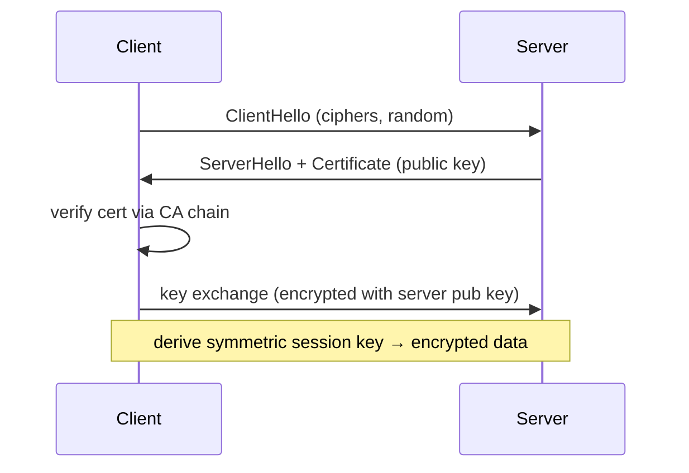

# Module 06 — TLS & Security

> **Agent spawn**: `@Memory.md` + `@Prompt.md` + this file + `@NOTES.md`
> **Nav**: ← [05 Application HTTP/DNS](../05-application-http-dns/MODULE.md) · Next → [07 DNS Deep Dive](../07-dns-deepdive/MODULE.md)

## At a glance
| | |
|---|---|
| Prerequisites | 05 |
| Duration | ~1 session |
| Exit test | TLS handshake + symmetric/asymmetric + cert trust |

## Visual map

```
Asymmetric (slow): used to EXCHANGE the key + verify identity (cert)
Symmetric (fast):  used for the actual DATA after handshake
TLS gives: Confidentiality + Integrity + Authentication
```
**Mental model**: TLS = asymmetric se safely ek symmetric key set karo, phir fast symmetric se baat karo. Certificate = CA ka signed proof ki "yeh public key sach mein google ka hai" → MITM rokta. TLS 1.3 = fewer RTTs.

**Redraw challenge**: TLS handshake sequence + asymmetric→symmetric handoff.

## Objectives
1. Symmetric vs asymmetric crypto
2. TLS handshake (1.2 vs 1.3)
3. Certificates + CA chain of trust
4. What TLS provides; MITM

## Topics
- Symmetric vs asymmetric; where each used
- TLS handshake; TLS 1.2 vs 1.3 (RTT reduction)
- Certificates; CA chain of trust; HTTPS
- Confidentiality/integrity/authentication; MITM; HSTS
- Attacks brief (replay, downgrade); firewall/VPN brief

## Assignments
| # | Task | Passing criteria |
|---|------|------------------|
| A1 | Trace TLS 1.3 handshake steps | Correct order + purpose each |
| A2 | Explain how a cert proves server identity | CA chain reasoning correct |

## Active recall bank
1. Asymmetric vs symmetric — kahan kaun?
2. Cert MITM kaise rokta?
3. TLS kya 3 cheezein deta?
4. TLS 1.3 1.2 se kyun fast?

## Progress checklist
- [ ] Handshake + cert trust from memory
- [ ] A1, A2 done
- [ ] NOTES.md updated
