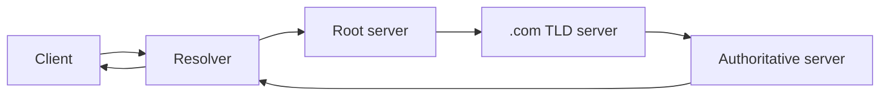

# Module 07 — DNS Deep Dive

> **Agent spawn**: `@Memory.md` + `@Prompt.md` + this file + `@NOTES.md`
> **Nav**: ← [06 TLS & Security](../06-tls-security/MODULE.md) · Next → [08 CDN, LB & Proxies](../08-cdn-lb-proxies/MODULE.md)

## At a glance
| | |
|---|---|
| Prerequisites | 05 |
| Duration | ~1 session |
| Exit test | Full recursive resolution + record types |

## Visual map

```
Records: A(IPv4) AAAA(IPv6) CNAME(alias) MX(mail) NS(nameserver)
         TXT(verify/SPF) SOA(zone) SRV(service) PTR(reverse)
Caching at every level, governed by TTL
```
**Mental model**: DNS = naam→IP ka distributed phonebook. Resolver recursively poochta: root → TLD (.com) → authoritative. Har jagah cache + TTL. Iterative = "main khud poochunga"; recursive = "tu laa ke de".

**Redraw challenge**: Full recursive resolution path root→TLD→authoritative.

## Objectives
1. DNS hierarchy + recursive vs iterative
2. Resolver caching + TTL
3. Record types
4. DNS for load balancing/failover

## Topics
- Hierarchy: root → TLD → authoritative
- Recursive vs iterative resolution; resolver + caching + TTL
- Records: A, AAAA, CNAME, MX, NS, TXT, SOA, SRV, PTR
- Reverse DNS; DNS over HTTPS/TLS; anycast
- DNS-based load balancing (round-robin, geo, failover)

## Assignments
| # | Task | Passing criteria |
|---|------|------------------|
| A1 | `dig +trace` a domain, narrate each step | Full path explained |
| A2 | Design DNS-based failover | TTL + health-check reasoning |

## Active recall bank
1. Recursive vs iterative resolution?
2. CNAME vs A record?
3. TTL low vs high — trade-off?
4. DNS-based LB kaise?

## Progress checklist
- [ ] Resolution path + records from memory
- [ ] A1, A2 done
- [ ] NOTES.md updated
