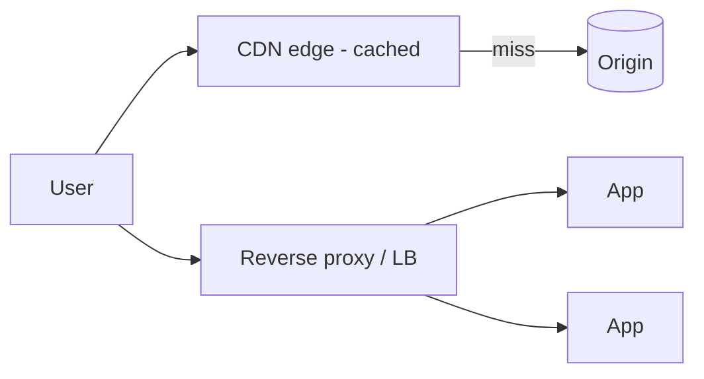

# Module 08 — CDN, Load Balancing & Proxies

> **Agent spawn**: `@Memory.md` + `@Prompt.md` + this file + `@NOTES.md`
> **Nav**: ← [07 DNS Deep Dive](../07-dns-deepdive/MODULE.md) · Next → [09 Sockets & Practical](../09-sockets-practical/MODULE.md)

## At a glance
| | |
|---|---|
| Prerequisites | 05 |
| Duration | ~1 session |
| Exit test | forward vs reverse proxy + L4 vs L7 + CDN cache |

## Visual map

```
Forward proxy : client ke aage (client ki pehchaan chhupaye, corporate filter)
Reverse proxy : server ke aage (LB, SSL termination, cache, hide backend)
L4 LB: IP/port (fast)  |  L7 LB: HTTP path/host/cookie (smart)
CDN: static content edge pe cache → latency kam, origin load kam
```
**Mental model**: Forward proxy client ki taraf, reverse proxy server ki taraf. CDN = content user ke paas (edge) la do. Yeh module HLD module 02 se directly judta — networks ka practical scaling.

**Redraw challenge**: forward vs reverse proxy + CDN edge/origin.

## Objectives
1. Forward vs reverse proxy
2. L4 vs L7 load balancing
3. CDN edge caching
4. SSL termination; gateway

## Topics
- CDN: edge caching, origin, cache-control, invalidation
- Forward vs reverse proxy
- L4 vs L7 LB (link: HLD module 02); LB algorithms
- SSL termination; sticky sessions; API gateway; edge compute brief

## Assignments
| # | Task | Passing criteria |
|---|------|------------------|
| A1 | CDN caching plan for static + dynamic content | Cache-control + invalidation correct |
| A2 | Forward vs reverse proxy use cases | 2 valid each |

## Active recall bank
1. Forward vs reverse proxy?
2. L4 vs L7 — kya dekh kar route?
3. SSL termination kahan hota?
4. CDN origin load kaise kam karta?

## Progress checklist
- [ ] Proxy types + CDN from memory
- [ ] A1, A2 done
- [ ] NOTES.md updated
