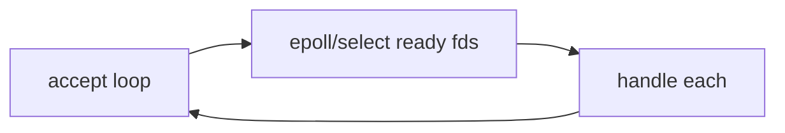

# Module 09 — Sockets & Practical

> **Agent spawn**: `@Memory.md` + `@Prompt.md` + this file + `@NOTES.md`
> **Nav**: ← [08 CDN, LB & Proxies](../08-cdn-lb-proxies/MODULE.md) · Next → [10 Interview Rapid-fire](../10-interview-rapidfire/MODULE.md)

## At a glance
| | |
|---|---|
| Prerequisites | 04 |
| Duration | ~1–2 sessions |
| Exit test | Socket lifecycle + blocking vs non-blocking + read a capture |

## Visual map
```
SERVER: socket() → bind() → listen() → accept() ──► recv()/send() → close()
CLIENT: socket() → connect() ──────────────────► send()/recv() → close()

Blocking: 1 thread per conn (simple, doesn't scale)
Non-blocking + select/epoll: 1 thread, many conns (C10k)  ← async servers
```

**Mental model**: Socket = endpoint (IP+port). Server bind/listen/accept; client connect. Scale ke liye blocking-per-thread se epoll/async pe jao (CV: tumne high-conn systems banaye). Tools se actual packets dekho.

**Redraw challenge**: server vs client socket lifecycle.

## Objectives
1. Berkeley socket API + lifecycle
2. Blocking vs non-blocking; select/epoll (C10k)
3. Python socket + asyncio
4. CLI tools: dig/curl/ss/tcpdump/traceroute

## Topics
- Socket API: socket/bind/listen/accept/connect/send/recv/close
- Blocking vs non-blocking; select/poll/epoll; C10k problem
- Python `socket` + `asyncio`
- Tools: `dig`, `curl`, `netstat`/`ss`, `tcpdump`/Wireshark, `traceroute`, `ping`, `nc`

## Assignments (Python)
| # | Task | Passing criteria |
|---|------|------------------|
| A1 | TCP echo server + client (stub + gaps) | Echoes correctly, clean close |
| A2 | Concurrent server (asyncio/select) for N clients | Handles many clients, no blocking |
| A3 | `tcpdump` a handshake, read it | SYN/SYN-ACK/ACK identified |

## Active recall bank
1. Socket lifecycle server vs client?
2. Blocking vs non-blocking — scale?
3. epoll select se kyun behtar (C10k)?

## Progress checklist
- [ ] Socket lifecycle from memory
- [ ] A1–A3 done
- [ ] NOTES.md updated
