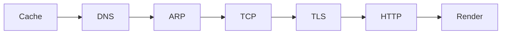

# Module 10 — Interview Rapid-fire 🔥

> **Agent spawn**: `@Memory.md` + `@Prompt.md` + this file + `@NOTES.md`
> **Nav**: ← [09 Sockets & Practical](../09-sockets-practical/MODULE.md)

## At a glance
| | |
|---|---|
| Prerequisites | 00–09 |
| Duration | ~1–2 sessions |
| Exit test | "type google.com" fluently + 12 rapid-fire |

## Visual map
```
TYPE google.com AND PRESS ENTER:
1. Browser/OS/hosts cache check
2. DNS resolve (resolver→root→TLD→authoritative, UDP 53, cached)
3. ARP for gateway MAC (local)
4. TCP 3-way handshake (port 443)
5. TLS handshake (cert verify, session key)
6. HTTP GET / → server
7. Response → parse HTML → fetch CSS/JS/img → render
```

**Mental model**: Yeh ek question poore networks ko jodta — har step ek module hai. Ratta nahi, layers se reason karo. Interviewer beech mein kahin bhi deep-dive karwa sakta.

**Redraw challenge**: full google.com path (7 steps) from memory.

## Objectives
1. "Type google.com" end-to-end
2. Crisp answers to top rapid-fire FAQ
3. Connect every answer to a layer

## Rapid-fire bank (bina notes ke)
1. What happens when you type google.com? (full path)
2. TCP vs UDP?
3. 3-way handshake + why 3?
4. HTTP vs HTTPS?
5. HTTP/2 vs HTTP/3?
6. Status code families?
7. How DNS works?
8. What is a socket?
9. L4 vs L7 LB?
10. How does ping/traceroute work?
11. Congestion vs flow control?
12. Cookies vs sessions vs tokens?

## Assignments
| # | Task | Passing criteria |
|---|------|------------------|
| A1 | Write the full "type google.com" answer | All 7 steps + which layer |
| A2 | Answer 12 rapid-fire crisply (record yourself) | Each ≤ 60s, correct |

## Progress checklist
- [ ] google.com walk-through fluent
- [ ] 12 rapid-fire confident
- [ ] **Network spaced-rep checklist** (LEARNING-PLAN) full pass
- [ ] NOTES.md updated
