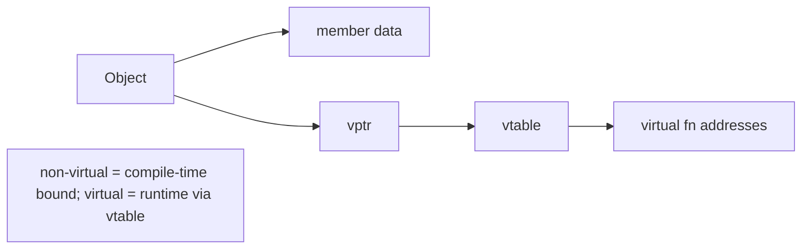

# OOP in C++ — Home

> Deep C++ OOP mastery for SDE-2 interviews (Uber/Google/Atlassian/Rippling). ← [[INTERVIEW-PREP|Master Index]] · applies to → [[LLD/Home|LLD]] & [[Machine Code/Home|Machine Coding]]

## Quick links
| Doc | Kya hai |
|-----|---------|
| [[OOPS/Memory\|Memory]] | Coach rules, profile, 36-topic map, CV hooks |
| [[OOPS/Prompt\|Prompt]] | **Tera** coach persona (36-topic C++ OOP curriculum) |
| [[OOPS/LEARNING-PLAN\|LEARNING-PLAN]] | **Full syllabus** — all 36 topics → 11 modules |
| [[OOPS/VISUAL-STUDY-GUIDE\|VISUAL-STUDY-GUIDE]] | vtable, Rule of 5, memory diagrams + spaced-rep |
| [[OOPS/examples/README\|Examples library]] 🔥 | Runnable C++ demos (Rule of 5, vtable, smart ptrs…) |

## Why this folder (vs LLD)
- **OOPS (yahan)** = C++ OOP **language mechanics** — constructors, Rule of 5, virtual/vtable, smart pointers, RAII, slicing, casts. Yeh neenv.
- **LLD** = in mechanics ko use karke **design** (SOLID + patterns + parking-lot type problems).
- OOPS pakka karo → LLD aur Machine Coding natural lagega.

## Modules
| # | Module | Notes | Covers (Prompt topics) |
|---|--------|-------|------------------------|
| 00 | [[OOPS/modules/00-why-oop-classes-objects/MODULE\|Why OOP + Classes/Objects]] | [[OOPS/modules/00-why-oop-classes-objects/NOTES\|NOTES]] | 1,2 |
| 01 | [[OOPS/modules/01-constructors-destructors/MODULE\|Constructors & Destructors]] | [[OOPS/modules/01-constructors-destructors/NOTES\|NOTES]] | 3,4 |
| 02 | [[OOPS/modules/02-copy-move-rule-of-5/MODULE\|Copy/Move & Rule of 3/5]] 🔥 | [[OOPS/modules/02-copy-move-rule-of-5/NOTES\|NOTES]] | 5–10,35 |
| 03 | [[OOPS/modules/03-encapsulation-abstraction/MODULE\|Encapsulation & Abstraction]] | [[OOPS/modules/03-encapsulation-abstraction/NOTES\|NOTES]] | 11,12,21 |
| 04 | [[OOPS/modules/04-inheritance-composition/MODULE\|Inheritance & Composition]] | [[OOPS/modules/04-inheritance-composition/NOTES\|NOTES]] | 13,27,28,29,36 |
| 05 | [[OOPS/modules/05-polymorphism/MODULE\|Polymorphism (virtual/vtable)]] 🔥 | [[OOPS/modules/05-polymorphism/NOTES\|NOTES]] | 14–20,25,26 |
| 06 | [[OOPS/modules/06-casting-rtti/MODULE\|Casting & RTTI]] | [[OOPS/modules/06-casting-rtti/NOTES\|NOTES]] | 30 |
| 07 | [[OOPS/modules/07-static-friend-operator-overloading/MODULE\|Static, Friend, Operator Overloading]] | [[OOPS/modules/07-static-friend-operator-overloading/NOTES\|NOTES]] | 22,23,21,24 |
| 08 | [[OOPS/modules/08-const-correctness/MODULE\|const Correctness]] | [[OOPS/modules/08-const-correctness/NOTES\|NOTES]] | 31 |
| 09 | [[OOPS/modules/09-memory-raii-smart-pointers/MODULE\|Memory, RAII & Smart Pointers]] 🔥 | [[OOPS/modules/09-memory-raii-smart-pointers/NOTES\|NOTES]] | 32,33,34 |
| 10 | [[OOPS/modules/10-interview-rapidfire/MODULE\|Interview Rapid-fire]] 🔥 | [[OOPS/modules/10-interview-rapidfire/NOTES\|NOTES]] | all + LLD bridge |

## Object in memory (the mental model)


## Vault path
```
/Users/vansh/Desktop/Code/Learning/OOPS
```
