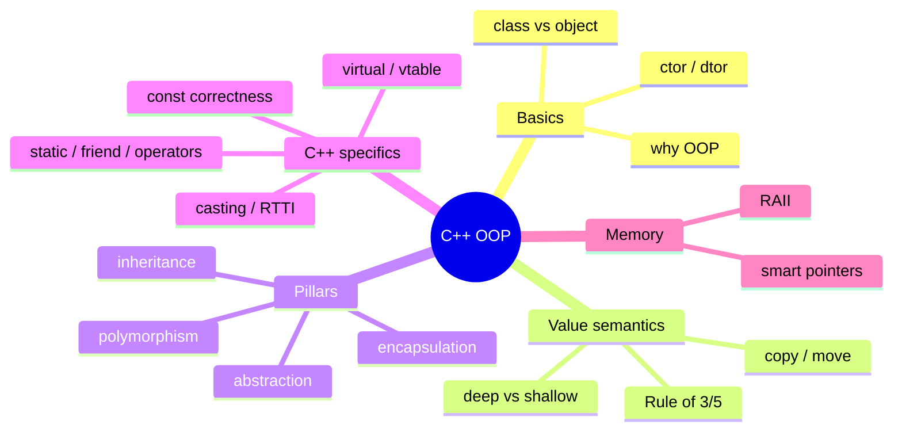

# OOP in C++ — Learning Plan (Full Syllabus)

> All 36 topics from `@Prompt.md` → 11 modules. Visual learner: har module `## Visual map`. Start: `@VISUAL-STUDY-GUIDE.md`.

## Mind map

---

## Module 00 — Why OOP + Classes/Objects (topics 1–2)
**Topics**: why OOP exists (manage complexity, model domain, reuse, encapsulate invariants) vs procedural; class (blueprint) vs object (instance); members + methods; access specifiers (public/private/protected); `struct` vs `class` in C++; object on stack vs heap.
**Exit**: why OOP; class vs object; stack vs heap object; struct vs class.

## Module 01 — Constructors & Destructors (topics 3–4)
**Topics**: default/parameterized ctors; member initializer lists (why > assignment); delegating ctors; `explicit`; `= default`/`= delete`; destructor (when called, order); **virtual destructor** (why needed for polymorphic base — top interview Q); ctor/dtor order in inheritance.
**Assignments**: A1 a class with initializer-list ctor + dtor logging; A2 show the bug when a base dtor isn't virtual.
**Exit**: initializer list why; virtual dtor why; ctor/dtor order.

## Module 02 — Copy/Move & Rule of 3/5 🔥 (topics 5–10, 35)
**Topics**: copy ctor + copy assignment; **deep vs shallow copy** (the classic raw-pointer bug); **Rule of 3**; move ctor + move assignment (`&&`, `std::move`, why moves are cheap); **Rule of 5**; Rule of 0 (let members manage); self-assignment check; copy-and-swap idiom; when compiler generates/deletes these.
**Assignments (C++)**: A1 a `Buffer` class with a raw pointer → implement Rule of 5 (deep copy + move); A2 show shallow-copy double-free, then fix.
**Exit**: deep vs shallow; Rule of 3 vs 5 vs 0; move semantics; copy-and-swap.

## Module 03 — Encapsulation & Abstraction (topics 11, 12, 21)
**Topics**: encapsulation (data + invariants behind methods; getters/setters debate); abstraction (expose what, hide how; ABC preview); **friend functions/classes** (when justified, why they break encapsulation carefully); access control.
**Assignments**: A1 an encapsulated class enforcing an invariant; A2 a friend `operator<<`.
**Exit**: encapsulation vs abstraction; friend — kab + cost.

## Module 04 — Inheritance & Composition (topics 13, 27, 28, 29, 36)
**Topics**: inheritance (public/protected/private — meaning); is-a vs has-a; **composition vs inheritance** ("favor composition"); upcasting (safe) vs downcasting (risky); **object slicing** (the by-value base bug); multiple inheritance + diamond problem (virtual inheritance brief); protected members.
**Assignments (C++)**: A1 model is-a (inheritance) vs has-a (composition); A2 reproduce object slicing, then fix with references/pointers.
**Exit**: composition vs inheritance; upcast vs downcast; object slicing cause+fix; diamond problem.

## Module 05 — Polymorphism (virtual/vtable) 🔥 (topics 14–20, 25, 26)
**Topics**: compile-time polymorphism (function/operator **overloading**, templates) vs runtime (virtual dispatch); **virtual functions** + how the **vtable/vptr** works; **pure virtual** + **abstract classes**; **interfaces in C++** (all-pure-virtual ABC); function **overriding** vs overloading vs hiding; `override`/`final`; vtable cost; `virtual` + default args pitfall.
**Assignments (C++)**: A1 abstract `Shape` + virtual `area()` + runtime dispatch via base pointer; A2 overload vs override vs hide — predict the call.
**Exit**: runtime vs compile-time polymorphism; vtable mechanics; pure virtual/abstract/interface; override vs overload vs hide.

## Module 06 — Casting & RTTI (topic 30)
**Topics**: `static_cast` vs `dynamic_cast` vs `const_cast` vs `reinterpret_cast`; **`dynamic_cast`** (downcast safety, returns nullptr/throws); RTTI + `typeid`; when dynamic_cast is a design smell (prefer virtual); cost of RTTI.
**Assignments**: A1 safe downcast with `dynamic_cast` + null check; A2 replace a `dynamic_cast` chain with a virtual method.
**Exit**: 4 casts — kab kaunsa; dynamic_cast safety; RTTI cost; when it signals bad design.

## Module 07 — Static, Friend, Operator Overloading (topics 22, 23, 21, 24)
**Topics**: static data members (shared, definition outside class); static member functions (no `this`); use cases (counters, factories, singletons); operator **overloading** (member vs non-member, `<<`, `==`, `+`, `[]`, when to overload, symmetry); friend for operators; rule "overload only when it reads naturally".
**Assignments (C++)**: A1 static instance counter; A2 a `Complex`/`Vector2D` with `+`, `==`, `<<`.
**Exit**: static member vs function; operator overloading member vs non-member; when NOT to overload.

## Module 08 — const Correctness (topic 31)
**Topics**: `const` everywhere — const objects, const member functions (and `mutable`), const refs/pointers (`const T*` vs `T* const`), const return; why const correctness matters (API contracts, optimization, interview signal); `constexpr` brief.
**Assignments**: A1 make a class const-correct (const methods, const& params); A2 fix const-violation errors.
**Exit**: const member fn meaning; `const T*` vs `T* const`; why const correctness.

## Module 09 — Memory, RAII & Smart Pointers 🔥 (topics 32–34)
**Topics**: stack vs heap; `new`/`delete`, why raw owning pointers are dangerous; **RAII** (resource = object lifetime; ctor acquires, dtor releases); **smart pointers** — `unique_ptr` (sole ownership, move-only), `shared_ptr` (ref-count), `weak_ptr` (break cycles); `make_unique`/`make_shared`; `shared_ptr` cycle leak + `weak_ptr` fix; ownership in design (CV: matching engine state).
**Assignments (C++)**: A1 replace raw new/delete with `unique_ptr`; A2 create + fix a `shared_ptr` reference cycle using `weak_ptr`.
**Exit**: RAII; unique vs shared vs weak; cycle leak + fix; ownership reasoning.

## Module 10 — Interview Rapid-fire 🔥 (all + LLD/MC bridge)
**Topics**: the C++ OOP FAQ bank — virtual destructor why, Rule of 5, deep vs shallow, vtable, object slicing, dynamic_cast vs static_cast, smart-pointer cycles, const correctness, overload vs override, RAII; **connect to LLD/Machine Coding** (virtual/abstract → Strategy/State patterns; composition → flexible design; smart pointers → object graphs).
**Assignments**: A1 answer 15 rapid-fire crisply (record); A2 take one LLD problem and point out which OOP concept powers each class.
**Exit**: deliver 15 rapid-fire fluently; map OOP → LLD/MC naturally.

---

## Weekly rhythm
Mon–Tue concept+recall · Wed–Thu coding exercise (g++) · Fri common-mistakes review + NOTES · Sat spaced recall · Sun rapid-fire + LLD bridge.

## Spaced repetition checklist (har 2 modules)
- [ ] virtual destructor — why
- [ ] Rule of 5 (which 5)
- [ ] deep vs shallow copy
- [ ] vtable/vptr mechanics
- [ ] object slicing cause+fix
- [ ] unique vs shared vs weak_ptr
- [ ] dynamic_cast vs static_cast
- [ ] const member function meaning
