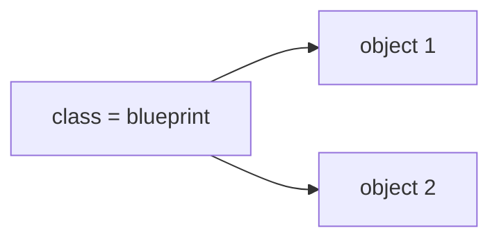

# Module 00 — Why OOP + Classes/Objects

> **Agent**: `@Memory.md` + `@Prompt.md` + this + `@NOTES.md` · Next → [01 Ctors/Dtors](../01-constructors-destructors/MODULE.md)
> Covers Prompt topics **1, 2**.

## Visual map
```
class BankAccount {           object (stack):  acc -> [ balance ]
  private: double balance;    object (heap):   new BankAccount() -> ptr -> [ balance ]
  public:  void deposit(d);
};
class vs struct (C++): struct default public, class default private. (else identical)
```

**Mental model**: OOP = complexity manage karne ka tareeka — data + uspe operations + invariants ko ek unit (class) mein band karo. Object = instance. Procedural mein data aur functions bikhre rehte; OOP mein bundle + protected.

## Topics
- Why OOP (model domain, encapsulate invariants, reuse, polymorphism) vs procedural
- class vs object; members + methods; access specifiers
- `struct` vs `class`; object on stack vs heap

## Per-concept drill (Prompt format)
- **Conceptual Q**: OOP procedural se kab better, kab overkill?
- **Coding exercise**: `BankAccount` with private balance + deposit/withdraw invariant (stub).
- **Common mistake**: public data members (no encapsulation); confusing class with object.
- **Why asked**: baseline — sets up everything.
- **LLD bridge**: every LLD class starts here.

## Active recall
1. class vs object?
2. struct vs class C++ mein?
3. stack vs heap object — kab kaunsa?

## Checklist
- [ ] class/object from memory · [ ] exercise coded · [ ] NOTES updated
