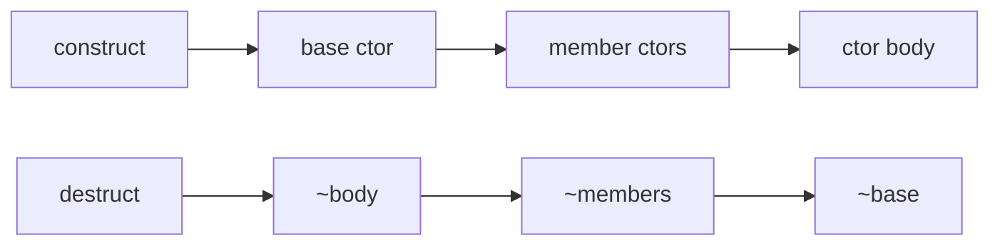

# Module 01 — Constructors & Destructors

> **Agent**: `@Memory.md` + `@Prompt.md` + this + `@NOTES.md` · ← [00](../00-why-oop-classes-objects/MODULE.md) · Next → [02 Copy/Move](../02-copy-move-rule-of-5/MODULE.md)
> Covers Prompt topics **3, 4**.

## Visual map
```
class T {
  T() = default;                 // default
  T(int x): x_(x) {}             // initializer list (init, not assign — required for const/ref)
  explicit T(int x);             // no implicit conversion
  ~T() { /* release */ }         // destructor
};
ctor order: base -> members (decl order) -> body. dtor: REVERSE.
VIRTUAL DESTRUCTOR: base* deleting a Derived -> needs virtual ~Base() else UB/leak.
```

**Mental model**: Ctor = object ko valid state mein laata (initializer list se init karo, body mein assign nahi). Dtor = cleanup. Polymorphic base ka dtor **virtual** hona must — warna `delete base_ptr` Derived ka dtor skip kar dega (leak/UB).

## Topics
- default/parameterized/delegating ctors; initializer list (why); `explicit`; `=default`/`=delete`
- destructor (when, order); **virtual destructor** (why); ctor/dtor order in inheritance

## Per-concept drill
- **Conceptual Q**: initializer list assignment se kyun better? virtual dtor kab chahiye?
- **Coding exercise**: class with initializer-list ctor + logging dtor; then show the missing-virtual-dtor leak (`examples/`).
- **Common mistake**: assigning in ctor body (const/ref members fail); forgetting virtual dtor.
- **Why asked**: virtual dtor is a top C++ interview filter.
- **LLD bridge**: every entity's lifecycle.

## Active recall
1. initializer list vs body assignment?
2. virtual destructor kab + kyun?
3. ctor/dtor order?

## Checklist
- [ ] virtual dtor reason from memory · [ ] exercise · [ ] NOTES updated
