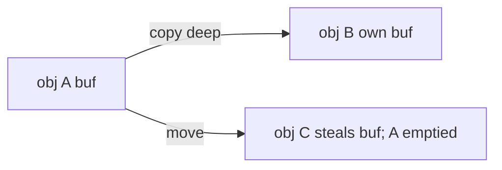

# Module 02 — Copy/Move & Rule of 3/5 🔥

> **Agent**: `@Memory.md` + `@Prompt.md` + this + `@NOTES.md` · ← [01](../01-constructors-destructors/MODULE.md) · Next → [03 Encapsulation](../03-encapsulation-abstraction/MODULE.md)
> Covers Prompt topics **5–10, 35**.

## Visual map
```
RULE OF 5 (class managing a raw resource):
  ~T()                       destructor
  T(const T&)                copy ctor      } deep copy
  T& operator=(const T&)     copy assign    }
  T(T&&) noexcept            move ctor      } steal pointer, null the source
  T& operator=(T&&) noexcept move assign    }
Rule of 0: members manage themselves (unique_ptr/vector) -> define NONE.

shallow copy: copy ptr -> 2 owners -> double free  ✗
deep copy:    copy data -> independent             ✓
move: transfer ownership (cheap), leave source empty
```

**Mental model**: Agar class raw resource (pointer/handle) own karti hai → compiler ka default copy = shallow (double-free bug). Toh Rule of 5 define karo (deep copy + cheap move). Better: Rule of 0 — `unique_ptr`/`vector` use karo, kuch define mat karo.

## Topics
- copy ctor + copy assignment; **deep vs shallow**; Rule of 3
- move ctor + move assignment (`&&`, `std::move`); Rule of 5; Rule of 0
- self-assignment check; copy-and-swap; when compiler generates/deletes

## Per-concept drill
- **Conceptual Q**: Rule of 3 vs 5 vs 0 — kab kaunsa? `std::move` actually kya karta?
- **Coding exercise**: `Buffer` with raw `int*` → implement Rule of 5 (`examples/rule_of_5.cpp` reference).
- **Common mistake**: shallow copy double-free; forgetting `noexcept` on move (kills vector perf); no self-assign check.
- **Why asked**: THE C++ value-semantics filter.
- **LLD bridge**: value vs reference semantics in your designs.

## Active recall
1. Rule of 3 vs 5 vs 0?
2. deep vs shallow copy?
3. move ctor kya karta (steal + null)?
4. `noexcept` on move kyun?

## Checklist
- [ ] Rule of 5 from memory · [ ] Buffer coded · [ ] NOTES updated
