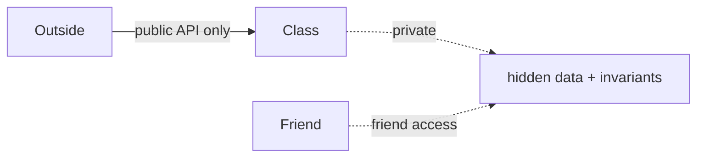

# Module 03 — Encapsulation & Abstraction

> **Agent**: `@Memory.md` + `@Prompt.md` + this + `@NOTES.md` · ← [02](../02-copy-move-rule-of-5/MODULE.md) · Next → [04 Inheritance](../04-inheritance-composition/MODULE.md)
> Covers Prompt topics **11, 12, 21**.

## Visual map
```
ENCAPSULATION: data private + methods guard invariants
  class Account { double bal; public: void withdraw(double a){ if(a<=bal) bal-=a; } };
ABSTRACTION: expose WHAT, hide HOW (interface vs impl)
FRIEND: grants access to private (e.g. operator<<) — use sparingly, it breaks encapsulation
```

**Mental model**: Encapsulation = invariants ko private state ke peeche guard karo (galat state ban hi na sake). Abstraction = caller ko sirf zaroori interface dikhao. Friend = controlled exception (operator<< ko private chahiye) — minimize.

## Topics
- encapsulation (invariants, getters/setters debate); abstraction (what vs how)
- `friend` functions/classes — when justified, the cost

## Per-concept drill
- **Conceptual Q**: encapsulation vs abstraction farak? friend encapsulation ko kaise weaken karta?
- **Coding exercise**: an encapsulated class enforcing an invariant + a friend `operator<<` (`examples/friend_function.cpp`).
- **Common mistake**: public data; getter/setter for everything (pseudo-encapsulation); overusing friend.
- **Why asked**: clean-design signal.
- **LLD bridge**: every well-designed class; SOLID's foundation.

## Active recall
1. encapsulation vs abstraction?
2. friend kab + cost?
3. getter/setter everywhere — kyun anti-pattern?

## Checklist
- [ ] enc vs abs from memory · [ ] exercise · [ ] NOTES updated
