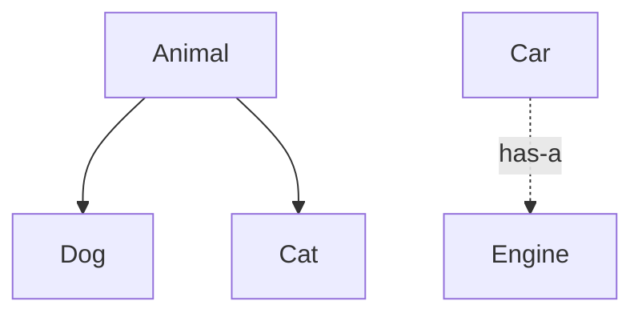

# Module 04 — Inheritance & Composition

> **Agent**: `@Memory.md` + `@Prompt.md` + this + `@NOTES.md` · ← [03](../03-encapsulation-abstraction/MODULE.md) · Next → [05 Polymorphism](../05-polymorphism/MODULE.md)
> Covers Prompt topics **13, 27, 28, 29, 36**.

## Visual map
```
is-a: Dog : public Animal        has-a: Car { Engine e; }  // favor composition
UPCAST  Derived* -> Base*  (safe, implicit)
DOWNCAST Base* -> Derived* (risky -> use dynamic_cast)
OBJECT SLICING:  Base b = derivedObj;  // only Base part copied, polymorphism LOST
  pass by Base& / Base*  to keep the Derived
diamond: B,C : A ; D : B,C -> two A's -> virtual inheritance
```

**Mental model**: Inheritance = is-a (tight coupling). Composition = has-a (flexible — "favor composition over inheritance"). Upcast safe, downcast risky. **Object slicing** = by-value base assignment Derived ka extra part kaat deta + polymorphism todta — isliye base ko ref/ptr se handle karo.

## Topics
- inheritance access (public/protected/private meaning); is-a vs has-a; composition vs inheritance
- upcasting vs downcasting; **object slicing**; multiple inheritance + diamond (virtual inheritance brief)

## Per-concept drill
- **Conceptual Q**: composition over inheritance kyun? object slicing kab hota?
- **Coding exercise**: is-a vs has-a model; reproduce slicing then fix (`examples/object_slicing.cpp`, `examples/composition_vs_inheritance.cpp`).
- **Common mistake**: inheriting for reuse (should compose); passing polymorphic objects by value (slicing).
- **Why asked**: design judgment + the slicing trap.
- **LLD bridge**: composition drives flexible designs (Strategy holds a strategy).

## Active recall
1. composition vs inheritance — kab kya?
2. upcast vs downcast?
3. object slicing cause + fix?
4. diamond problem?

## Checklist
- [ ] slicing + composition from memory · [ ] exercises · [ ] NOTES updated
