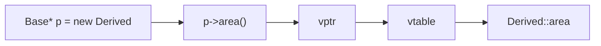

# Module 05 — Polymorphism (virtual/vtable) 🔥

> **Agent**: `@Memory.md` + `@Prompt.md` + this + `@NOTES.md` · ← [04](../04-inheritance-composition/MODULE.md) · Next → [06 Casting](../06-casting-rtti/MODULE.md)
> Covers Prompt topics **14–20, 25, 26**.

## Visual map
```
compile-time poly: function/operator OVERLOADING, templates  (resolved by static type)
runtime poly:      VIRTUAL functions via vptr -> vtable       (resolved by dynamic type)

obj: [ vptr ] -> vtable -> [ &Derived::f ]   // base_ptr->f() calls Derived::f
pure virtual: virtual void f() = 0;  -> ABSTRACT class (can't instantiate)
interface in C++ = ABC with ALL pure-virtual (+ virtual dtor)
override vs overload vs HIDE (same name in derived hides base overloads)
```

**Mental model**: Polymorphism do tarah — compile-time (overloading/templates) aur runtime (virtual + vtable). Runtime = base pointer/ref se sahi derived method call hota (vptr→vtable). Pure virtual = abstract (interface). `override`/`final` use karo. Slicing isko todta.

## Topics
- compile-time (overloading, templates) vs runtime (virtual dispatch)
- virtual functions + **vtable/vptr**; pure virtual; abstract classes; **interfaces in C++**
- overriding vs overloading vs hiding; `override`/`final`; virtual+default-arg pitfall

## Per-concept drill
- **Conceptual Q**: vtable kaise kaam karta? abstract class instantiate kyun nahi hoti?
- **Coding exercise**: abstract `Shape` + virtual `area()` + dispatch via base ptr (`examples/virtual_functions_vtable.cpp`, `abstract_interface.cpp`); overload vs override predict (`function_overload_override.cpp`).
- **Common mistake**: missing `override` (silent non-override); name hiding; calling virtual in ctor/dtor.
- **Why asked**: THE polymorphism filter; vtable is a favorite.
- **LLD bridge**: virtual/abstract = Strategy/State/Factory backbone.

## Active recall
1. runtime vs compile-time polymorphism?
2. vtable/vptr dispatch?
3. pure virtual / abstract / interface?
4. override vs overload vs hide?

## Checklist
- [ ] vtable from memory · [ ] exercises · [ ] NOTES updated
