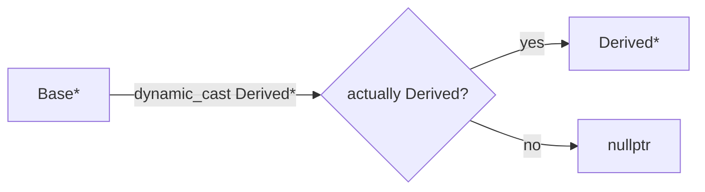

# Module 06 — Casting & RTTI

> **Agent**: `@Memory.md` + `@Prompt.md` + this + `@NOTES.md` · ← [05](../05-polymorphism/MODULE.md) · Next → [07 Static/Friend/Operators](../07-static-friend-operator-overloading/MODULE.md)
> Covers Prompt topic **30**.

## Visual map
```
static_cast<T>      compile-time, related/numeric, NO runtime check (you promise it's valid)
dynamic_cast<T>     runtime, safe downcast: ptr -> nullptr on fail | ref -> throws bad_cast
                    (needs polymorphic type = at least one virtual fn + RTTI)
const_cast<T>       add/remove const
reinterpret_cast<T> raw bit reinterpret (danger; avoid)
typeid / RTTI       runtime type info
```

**Mental model**: 4 casts, alag-alag intent. `dynamic_cast` = safe downcast (runtime check, nullptr/throw on fail). Bahut zyada `dynamic_cast` = design smell → virtual method se replace karo. static_cast trust-based.

## Topics
- `static_cast`/`dynamic_cast`/`const_cast`/`reinterpret_cast`
- dynamic_cast safety (ptr nullptr / ref throw); RTTI + `typeid`; when dynamic_cast signals bad design; RTTI cost

## Per-concept drill
- **Conceptual Q**: static_cast vs dynamic_cast — kab kaunsa? dynamic_cast design smell kab?
- **Coding exercise**: safe downcast with null check; then replace a dynamic_cast chain with virtual (`examples/dynamic_cast_rtti.cpp`).
- **Common mistake**: static_cast for downcast (no safety → UB); dynamic_cast without virtual (won't compile/work).
- **Why asked**: type-system depth.
- **LLD bridge**: prefer virtual dispatch over type-checks (OCP).

## Active recall
1. 4 casts — kaunsa kab?
2. dynamic_cast fail pe kya (ptr vs ref)?
3. dynamic_cast smell kab?

## Checklist
- [ ] casts from memory · [ ] exercise · [ ] NOTES updated
