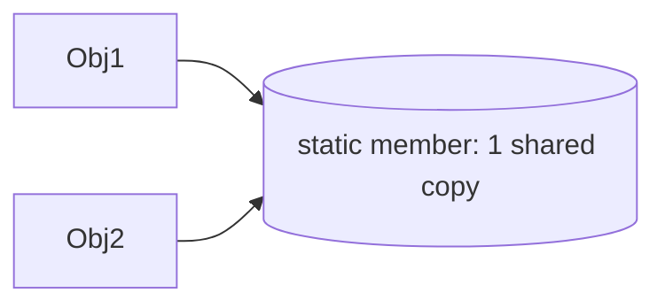

# Module 07 — Static, Friend & Operator Overloading

> **Agent**: `@Memory.md` + `@Prompt.md` + this + `@NOTES.md` · ← [06](../06-casting-rtti/MODULE.md) · Next → [08 const](../08-const-correctness/MODULE.md)
> Covers Prompt topics **22, 23, 21, 24**.

## Visual map
```
static data member: shared across ALL objects (one copy); define outside class
static member fn:    no `this`; calls without an object (Counter::count())
operator overloading: member  a + b  -> a.operator+(b)   |  non-member symmetric (1 + a)
  overload <<  as non-member friend (needs ostream on left)
RULE: overload only when it reads naturally (Vector + Vector ✓; weird semantics ✗)
```

**Mental model**: static member = class-level shared state (counter/registry); static fn = no object needed. Operator overloading = apne type ko built-in jaisa use karne do (`a + b`, `cout << a`) — par sirf jab semantics natural ho.

## Topics
- static data members (definition outside class); static member functions (no `this`); use cases (counter/factory/singleton)
- operator overloading (member vs non-member, `<<`/`==`/`+`/`[]`); friend for operators; when NOT to overload

## Per-concept drill
- **Conceptual Q**: static member vs static fn? `<<` non-member kyun?
- **Coding exercise**: static instance counter (`examples/static_members.cpp`); `Vector2D`/`Complex` with `+`,`==`,`<<` (`examples/operator_overloading.cpp`).
- **Common mistake**: forgetting to define static member outside; overloading operators with surprising semantics.
- **Why asked**: idiomatic C++ + Singleton/Factory link.
- **LLD bridge**: Singleton (static), value types (operators).

## Active recall
1. static member vs static fn?
2. `<<` member ya non-member, kyun?
3. when NOT to overload?

## Checklist
- [ ] static + operators from memory · [ ] exercises · [ ] NOTES updated
