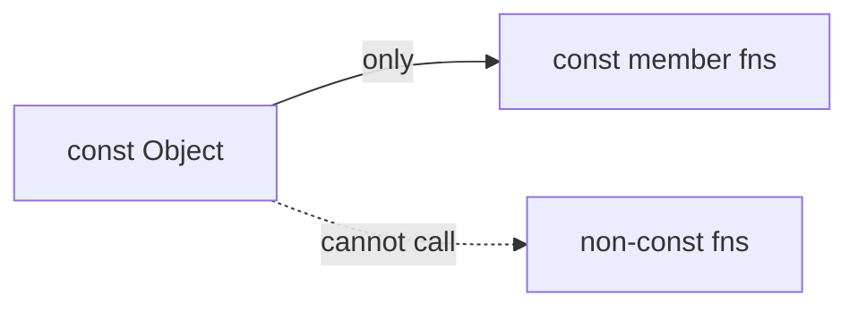

# Module 08 — const Correctness

> **Agent**: `@Memory.md` + `@Prompt.md` + this + `@NOTES.md` · ← [07](../07-static-friend-operator-overloading/MODULE.md) · Next → [09 Memory/RAII](../09-memory-raii-smart-pointers/MODULE.md)
> Covers Prompt topic **31**.

## Visual map
```
const member fn:  int get() const { return x_; }   // promises not to modify *this
                  (only const fns callable on a const object)
mutable:          a member you CAN change even in a const fn (cache/mutex)
const T*  -> pointer to const data (data fixed, ptr can move)
T* const  -> const pointer (ptr fixed, data can change)
const T&  param -> no copy + no modify (idiomatic pass)
```

**Mental model**: `const` = compiler-enforced contract "main isko nahi badlunga". const object pe sirf const methods chalti. `const T&` params = cheap + safe (no copy, no mutate). Pointer const do tarah: `const T*` (data const) vs `T* const` (ptr const). Interview signal of discipline.

## Topics
- const objects; const member functions; `mutable`; const refs/pointers (`const T*` vs `T* const`); const return; why it matters; `constexpr` brief

## Per-concept drill
- **Conceptual Q**: const member fn kya guarantee deta? `const T*` vs `T* const`?
- **Coding exercise**: make a class fully const-correct (const getters, const& params); fix const-violation errors (`examples/const_correctness.cpp`).
- **Common mistake**: non-const getters; not marking methods const → can't use on const objects; const_cast hacks.
- **Why asked**: API design discipline.
- **LLD bridge**: const-correct interfaces = clear contracts.

## Active recall
1. const member fn meaning?
2. `const T*` vs `T* const`?
3. `mutable` kab?

## Checklist
- [ ] const rules from memory · [ ] exercise · [ ] NOTES updated
