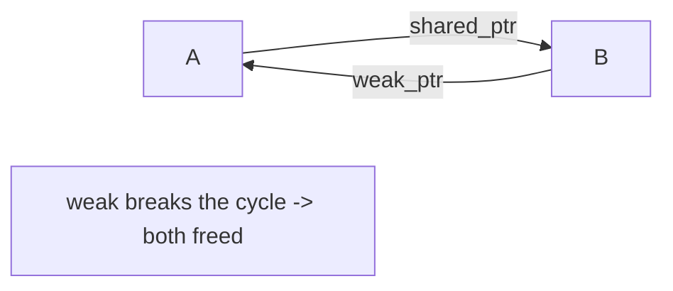

# Module 09 — Memory, RAII & Smart Pointers 🔥

> **Agent**: `@Memory.md` + `@Prompt.md` + this + `@NOTES.md` · ← [08](../08-const-correctness/MODULE.md) · Next → [10 Rapid-fire](../10-interview-rapidfire/MODULE.md)
> Covers Prompt topics **32, 33, 34**.

## Visual map
```
RAII: resource lifetime = object lifetime. ctor acquires, dtor releases (no manual delete).
unique_ptr<T>  sole owner, move-only         make_unique<T>()   (default choice)
shared_ptr<T>  ref-counted shared owner      make_shared<T>()
weak_ptr<T>    non-owning observer; .lock()  -> breaks shared_ptr CYCLES

CYCLE LEAK: A.shared_ptr<B>  +  B.shared_ptr<A>  -> refcount never 0 -> leak
FIX: make one side weak_ptr.
```

**Mental model**: Manual `new`/`delete` = leaks/double-free. **RAII** = resource ko object mein wrap karo, dtor cleanup karega (exception-safe bhi). Smart pointers RAII for heap: `unique_ptr` (one owner), `shared_ptr` (shared, ref-count), `weak_ptr` (observe, break cycles). CV: ownership = matching-engine state lifetime.

## Topics
- stack vs heap; `new`/`delete` dangers; **RAII**
- `unique_ptr`/`shared_ptr`/`weak_ptr`; `make_unique`/`make_shared`; **cycle leak + weak_ptr fix**; ownership in design

## Per-concept drill
- **Conceptual Q**: RAII kya guarantee deta? unique vs shared vs weak — kab kaunsa? shared_ptr cycle kaise leak karta?
- **Coding exercise**: replace raw new/delete with `unique_ptr` (`examples/smart_pointers.cpp`, `raii.cpp`); create + fix a shared_ptr cycle with weak_ptr.
- **Common mistake**: `shared_ptr` everywhere (overhead + cycles); raw owning pointers; `delete` in the wrong path (use RAII).
- **Why asked**: memory safety + ownership reasoning (huge at Uber/Google).
- **LLD bridge**: object graphs, ownership in your designs.

## Active recall
1. RAII?
2. unique vs shared vs weak_ptr?
3. shared_ptr cycle leak + fix?
4. make_shared vs new shared_ptr?

## Checklist
- [ ] RAII + smart ptrs from memory · [ ] exercises · [ ] NOTES updated
