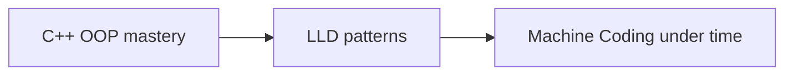

# Module 10 — Interview Rapid-fire 🔥 (+ LLD/Machine-Coding bridge)

> **Agent**: `@Memory.md` + `@Prompt.md` + this + `@NOTES.md` · ← [09](../09-memory-raii-smart-pointers/MODULE.md)
> Covers **all topics** + the bridge to [[LLD/Home|LLD]] & [[Machine Code/Home|Machine Coding]].

## Visual map
```
OOP concept            -> where it powers design
virtual / abstract     -> Strategy, State, Factory, template method
composition            -> "has-a" flexible design (favor over inheritance)
smart pointers         -> object graphs / ownership in LLD
RAII / Rule of 5       -> resource-owning classes
const correctness      -> clean interfaces
```

**Mental model**: OOP solid hone se LLD ke patterns "obvious" lagte (har pattern OOP mechanics pe khada). Yeh module = rapid-fire FAQ + ek LLD problem leke uske har class ko OOP concept se map karna.

## Rapid-fire bank (bina notes ke, crisp)
1. virtual destructor — kab + kyun?
2. Rule of 5 — kaunse 5? Rule of 0 kab?
3. deep vs shallow copy?
4. vtable/vptr kaise dispatch karta?
5. object slicing kab hota, fix?
6. unique vs shared vs weak_ptr? shared_ptr cycle?
7. dynamic_cast vs static_cast?
8. override vs overload vs hide?
9. abstract class vs interface (C++)?
10. const member function kya guarantee?
11. compile-time vs runtime polymorphism?
12. RAII kya, kyun exception-safe?
13. `std::move` actually kya karta?
14. why composition over inheritance?
15. operator overloading — kab NOT?

## Assignments
| # | Task | Passing criteria |
|---|------|------------------|
| A1 | 15 rapid-fire crisply (record yourself) | Each ≤ 60s, correct |
| A2 | Take 1 LLD problem (e.g. Parking Lot) → map each class to its OOP concept | Every class justified |

## Checklist
- [ ] 15 rapid-fire fluent
- [ ] OOP → LLD mapping done
- [ ] **OOP spaced-rep checklist** (LEARNING-PLAN) full pass
- [ ] NOTES updated
