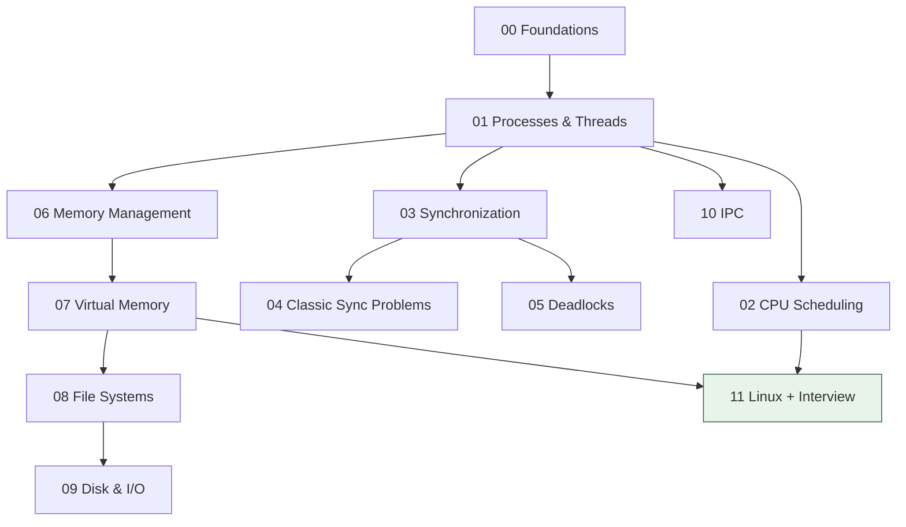

# Operating System — Home

> OS vault entry point. **Padhai yahan se shuru karo.** ← back to [[INTERVIEW-PREP|Master Index]]

## Quick links

| Doc | Kya hai |
|-----|---------|
| [[Operating System/Memory\|Memory]] | Coach rules, learner profile, CV→OS hooks |
| [[Operating System/Prompt\|Prompt]] | Hinglish coach persona (paste into Claude/Cursor) |
| [[Operating System/LEARNING-PLAN\|LEARNING-PLAN]] | **Full syllabus** — har topic, assignment, exit criteria |
| [[Operating System/VISUAL-STUDY-GUIDE\|VISUAL-STUDY-GUIDE]] | Master diagrams + spaced-rep bank |

## Modules (MODULE → padho, NOTES → likho)

| # | Syllabus | My notes | Focus |
|---|----------|----------|-------|
| 00 | [[Operating System/modules/00-foundations/MODULE\|Foundations]] | [[Operating System/modules/00-foundations/NOTES\|NOTES]] | Kernel, modes, syscalls, boot |
| 01 | [[Operating System/modules/01-processes-threads/MODULE\|Processes & Threads]] | [[Operating System/modules/01-processes-threads/NOTES\|NOTES]] | PCB, context switch, fork |
| 02 | [[Operating System/modules/02-cpu-scheduling/MODULE\|CPU Scheduling]] | [[Operating System/modules/02-cpu-scheduling/NOTES\|NOTES]] | FCFS→MLFQ, CFS |
| 03 | [[Operating System/modules/03-synchronization/MODULE\|Synchronization]] | [[Operating System/modules/03-synchronization/NOTES\|NOTES]] | Mutex, semaphore, monitor |
| 04 | [[Operating System/modules/04-classic-sync-problems/MODULE\|Classic Sync Problems]] | [[Operating System/modules/04-classic-sync-problems/NOTES\|NOTES]] | Producer-consumer, dining philosophers |
| 05 | [[Operating System/modules/05-deadlocks/MODULE\|Deadlocks]] | [[Operating System/modules/05-deadlocks/NOTES\|NOTES]] | Coffman, Banker's |
| 06 | [[Operating System/modules/06-memory-management/MODULE\|Memory Management]] | [[Operating System/modules/06-memory-management/NOTES\|NOTES]] | Paging, segmentation, TLB |
| 07 | [[Operating System/modules/07-virtual-memory/MODULE\|Virtual Memory]] | [[Operating System/modules/07-virtual-memory/NOTES\|NOTES]] | Demand paging, LRU, thrashing |
| 08 | [[Operating System/modules/08-file-systems/MODULE\|File Systems]] | [[Operating System/modules/08-file-systems/NOTES\|NOTES]] | inodes, journaling |
| 09 | [[Operating System/modules/09-disk-io-scheduling/MODULE\|Disk & I/O Scheduling]] | [[Operating System/modules/09-disk-io-scheduling/NOTES\|NOTES]] | SCAN, C-SCAN, SSTF |
| 10 | [[Operating System/modules/10-ipc/MODULE\|IPC]] | [[Operating System/modules/10-ipc/NOTES\|NOTES]] | Pipes, shared mem, signals |
| 11 | [[Operating System/modules/11-linux-practical-interview/MODULE\|Linux + Interview Rapid-fire]] | [[Operating System/modules/11-linux-practical-interview/NOTES\|NOTES]] | strace, /proc, top, FAQ |

## Reading workflow (visual learner)

1. **Home** → current module ka **MODULE** kholo
2. **Visual map pehle** (2 min) — mermaid + ASCII
3. Topics padho — har topic ko diagram se map karo
4. Session end: **Redraw challenge** — bina dekhe draw karo → `NOTES.md → ## My diagrams`
5. Active recall / drills → coach agent (`@Memory.md @Prompt.md @modules/XX/MODULE.md`)
6. Progress checklist tick karo

## Dependency order



## Vault path

```
/Users/vansh/Desktop/Code/Learning/Operating System
```
