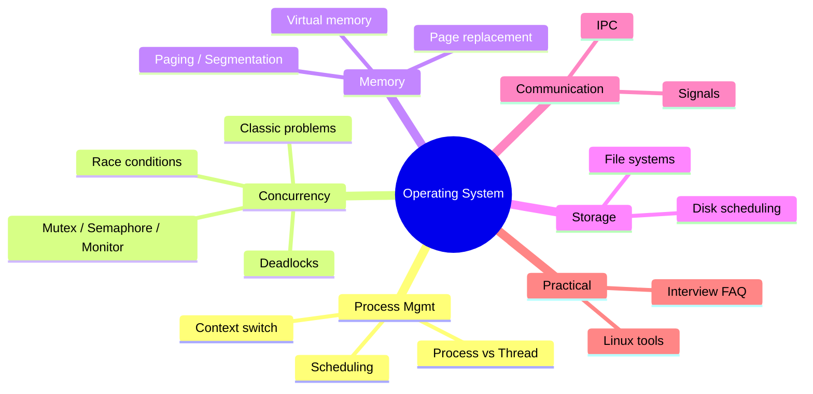
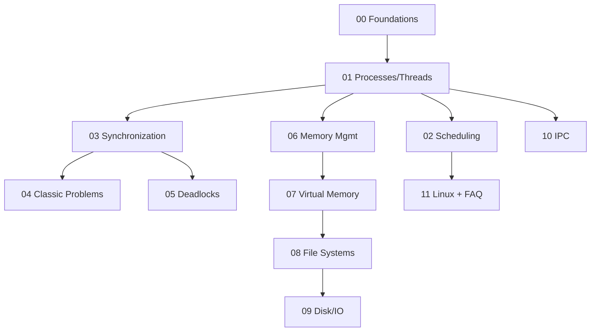

# Operating System — Learning Plan (Full Syllabus)

> **Pace**: ~1 session per module, heavy modules (03, 04, 07) ~2. Quality > calendar.
> **Visual learner**: har module mein `## Visual map`. Start: `@VISUAL-STUDY-GUIDE.md`.
> **No standard topic left out** — yeh complete interview syllabus hai.

## Mind map

## Dependency graph

---

## Module 00 — Foundations
**Topics**: What an OS does (resource manager + abstraction); kernel vs user mode; system calls & traps; interrupts vs polling; monolithic vs microkernel vs hybrid; boot sequence (BIOS/UEFI → bootloader → kernel → init); dual-mode protection rings; the role of the scheduler/MMU/file system.
**Exit criteria**:
- [ ] User mode vs kernel mode transition (syscall path) diagram bina dekhe
- [ ] "Why can't a user program directly touch hardware?" explain
- [ ] 5 examples of syscalls aur unka category (process, file, IPC, info, device)

## Module 01 — Processes & Threads
**Topics**: Process vs program vs thread; PCB (what's inside); process states (new/ready/running/waiting/terminated) + state diagram; context switch (cost, what's saved); `fork()`/`exec()`/`wait()`/`exit()`; zombie & orphan processes; thread models (user vs kernel threads, 1:1, M:N); thread vs process trade-offs; multithreading benefits/costs; copy-on-write.
**Assignments (C++)**: A1 simulate process state transitions; A2 `std::thread` vs `fork()` process benchmark (CPU-bound vs I/O-bound); A3 fork bomb explanation + safe demo.
**Exit criteria**:
- [ ] Process state diagram from memory
- [ ] Zombie vs orphan — kaise bante, kaun reap karta
- [ ] Threads vs processes trade-off (Python GIL = interview trivia; C++ threads truly parallel)

## Module 02 — CPU Scheduling
**Topics**: Scheduling criteria (CPU util, throughput, turnaround, waiting, response time); preemptive vs non-preemptive; FCFS, SJF, SRTF, Priority (+ starvation, aging), Round Robin (quantum trade-off), Multilevel Queue, MLFQ; convoy effect; Linux CFS (vruntime, red-black tree) intro; real-time scheduling (rate-monotonic, EDF) basics.
**Assignments (C++)**: A1 scheduler simulator — given processes (arrival, burst) compute Gantt + avg waiting/turnaround for FCFS/SJF/RR (stub + tests); A2 add priority + aging.
**Exit criteria**:
- [ ] Gantt chart + waiting time for FCFS/SJF/SRTF/RR by hand
- [ ] Convoy effect + starvation + aging explain
- [ ] RR quantum: bahut chhota vs bahut bada — trade-off

## Module 03 — Synchronization
**Topics**: Race condition; critical section problem (mutual exclusion, progress, bounded waiting); Peterson's solution; hardware support (test-and-set, compare-and-swap, atomic); mutex vs semaphore (binary vs counting); monitors & condition variables; spinlock vs blocking lock; busy-waiting; priority inversion (Mars Pathfinder story).
**Assignments (C++)**: A1 demonstrate a race condition with threads + fix with `Lock`; A2 implement a counting semaphore from a Lock + Condition (stub + test); A3 bounded buffer with `Condition`.
**Exit criteria**:
- [ ] 3 critical-section requirements
- [ ] Mutex vs semaphore — kab kaunsa, ownership difference
- [ ] CAS kaise lock-free counter banata hai
- [ ] Priority inversion + priority inheritance

## Module 04 — Classic Synchronization Problems
**Topics**: Producer–Consumer (bounded buffer); Readers–Writers (reader-pref, writer-pref, fair); Dining Philosophers (deadlock + solutions: resource ordering, arbitrator, limit diners); Sleeping Barber; Cigarette Smokers (bonus).
**Assignments (C++)**: A1 producer–consumer with `std::queue` + `std::mutex`/`std::condition_variable` (stub + passing test: no lost/dup items); A2 dining philosophers — show deadlock, then fix with ordering (must not deadlock under stress test).
**Exit criteria**:
- [ ] Har classic problem ka core hazard + fix
- [ ] Dining philosophers deadlock proof (Coffman conditions se map)

## Module 05 — Deadlocks
**Topics**: 4 Coffman conditions (mutual exclusion, hold-and-wait, no preemption, circular wait); resource allocation graph (+ cycle detection); deadlock handling: prevention (break each condition), avoidance (Banker's algorithm, safe state), detection + recovery, ostrich algorithm; livelock vs starvation vs deadlock.
**Assignments (C++)**: A1 detect deadlock via cycle detection in RAG (stub + tests); A2 Banker's algorithm safety check (stub + test cases safe/unsafe).
**Exit criteria**:
- [ ] 4 conditions + break karne ke 4 tareeke
- [ ] Banker's: safe sequence nikalna by hand
- [ ] Deadlock vs livelock vs starvation

## Module 06 — Memory Management
**Topics**: Address binding (compile/load/execution time); logical vs physical address; MMU; contiguous allocation + external/internal fragmentation; paging (page table, frame, offset); TLB (hit/miss, effective access time); multilevel page tables; inverted page table; segmentation; segmentation + paging combo.
**Assignments (C++)**: A1 logical→physical address translation given page size + page table (stub + tests); A2 EAT calculator given TLB hit ratio + access times.
**Exit criteria**:
- [ ] Logical addr → page# + offset → physical, by hand
- [ ] Internal vs external fragmentation
- [ ] TLB EAT formula + why multilevel page tables

## Module 07 — Virtual Memory
**Topics**: Demand paging; page fault handling (full path); page replacement: FIFO (+ Belady's anomaly), Optimal, LRU (+ approximations: clock/second-chance, aging), LFU, MFU; frame allocation (equal, proportional); thrashing; working set model; page buffering; copy-on-write revisited; memory-mapped files.
**Assignments (C++)**: A1 page replacement simulator — FIFO/LRU/Optimal, count faults (stub + tests, show Belady on FIFO); A2 working-set window computation.
**Exit criteria**:
- [ ] Page fault handling steps from memory
- [ ] FIFO/LRU/Optimal fault count by hand + Belady's anomaly
- [ ] Thrashing kyun hota, working set se fix

## Module 08 — File Systems
**Topics**: File concept, attributes, operations; directory structures (single, tree, acyclic graph); file allocation (contiguous, linked, indexed/inode); free space management (bitmap, linked list); inodes deep (direct/indirect/double/triple pointers — max file size calc); journaling (why, redo/undo); hard vs soft links; FAT vs ext4 vs NTFS overview; VFS layer.
**Assignments (C++)**: A1 compute max file size from inode pointer scheme; A2 simulate a simple inode-based file lookup (stub).
**Exit criteria**:
- [ ] inode max file size calculation
- [ ] Hard link vs soft link — inode behaviour
- [ ] Journaling crash-consistency kaise deta hai

## Module 09 — Disk & I/O Scheduling
**Topics**: HDD geometry (seek, rotational latency, transfer); disk scheduling: FCFS, SSTF, SCAN, C-SCAN, LOOK, C-LOOK (total head movement calc); RAID levels (0,1,5,6,10) trade-offs; SSD vs HDD (no seek, wear leveling, TRIM); I/O models (blocking, non-blocking, async); page cache / buffering; DMA.
**Assignments (C++)**: A1 disk scheduling simulator — head movement for each algorithm (stub + tests).
**Exit criteria**:
- [ ] Head movement for SSTF/SCAN/C-SCAN by hand
- [ ] RAID 5 vs RAID 10 trade-off
- [ ] SSD HDD se kyun alag (no seek, wear)

## Module 10 — Inter-Process Communication (IPC)
**Topics**: Shared memory vs message passing; pipes (anonymous, named/FIFO); message queues; sockets (Unix domain vs network); signals (SIGKILL/SIGTERM/SIGINT/SIGSEGV, handlers); semaphores for IPC; memory-mapped IPC; synchronous vs async messaging; (bridge to Kafka/Redis pub-sub from CV).
**Assignments (C++)**: A1 producer/consumer across processes via POSIX `pipe()` / shared memory (`fork()`); A2 signal handler demo (graceful shutdown).
**Exit criteria**:
- [ ] Shared memory vs message passing trade-off
- [ ] SIGKILL vs SIGTERM — kaunsa catchable
- [ ] Pipe vs message queue vs socket — kab kya

## Module 11 — Linux Practical + Interview Rapid-fire
**Topics**: `/proc` & `/sys`; `top`/`htop`/`ps`/`vmstat`/`iostat` reading; `strace`/`ltrace`; load average meaning; OOM killer; cgroups & namespaces (→ containers/Docker bridge); file descriptors & `lsof`; `nice`/`renice`. **Rapid-fire FAQ**: process vs thread, deadlock, paging vs segmentation, virtual memory, context switch cost, what happens on `malloc`, mutex vs semaphore, threads vs processes, fork vs exec.
**Assignments**: A1 read a `top` snapshot — explain CPU/mem/load; A2 use `strace` on a C++ script, identify syscalls.
**Exit criteria**:
- [ ] Load average 3 numbers ka matlab
- [ ] Containers = namespaces + cgroups explain
- [ ] 10 rapid-fire FAQ confidently

---

## Weekly rhythm

| Day | Focus |
|-----|-------|
| Mon–Tue | Concept + active recall (coach) |
| Wed–Thu | Assignment implementation (C++) |
| Fri | Interview-twist drills + NOTES update |
| Sat | Spaced recall — bina notes ke explain |
| Sun | Buffer |

## Spaced repetition checklist (har 2 modules ke baad)

- [ ] Process state diagram redraw
- [ ] Mutex vs semaphore
- [ ] 4 deadlock conditions
- [ ] FIFO/LRU/Optimal fault count
- [ ] Paging address translation
- [ ] Context switch — kya save hota hai
