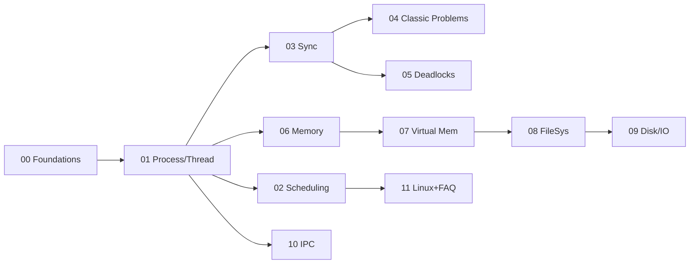
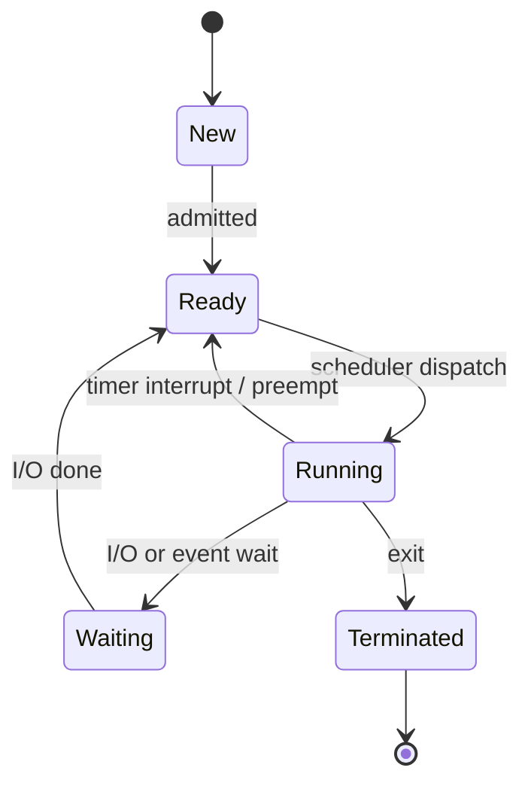

# OS Visual Study Guide — Vansh

> Tum **visual learner** ho. Yeh master cheat sheet — diagrams pehle, redraw se recall.

## Full journey (bird's eye)



## Process state machine (memorize this)



## User vs Kernel mode (syscall path)

```
USER MODE                          KERNEL MODE
 app code  ──read()──► trap/int 0x80 ──► syscall handler
                                          │ does privileged I/O
 app code  ◄── return value ◄─────────────┘
 (mode bit = 1)                     (mode bit = 0)
```

## Memory translation (paging)

```
logical addr = [ page number | offset ]
                     │            │
                     ▼            │
              page table ─► frame number
                                  │
physical addr = [ frame number | offset ]
   speed-up: TLB caches page→frame
```

## Page replacement intuition

```
FIFO   : oldest-loaded evict   (suffers Belady's anomaly)
LRU    : least-recently-used   (good, needs tracking)
Optimal: farthest-future use   (theoretical best, not implementable)
Clock  : LRU approx, 2nd chance bit
```

## Deadlock = all 4 hold

```
[Mutual Exclusion] + [Hold & Wait] + [No Preemption] + [Circular Wait]
break any ONE  →  no deadlock
```

## CV → OS visual bridge

```
ROOTSTOCK / PROJECTS          OS CONCEPT
────────────────────          ──────────
Kafka workers           ───►  Scheduling, context switch
Matching engine (Redis) ───►  Race conditions, locks
Savepoints / rollback   ───►  Checkpointing
Outbox exactly-once     ───►  Atomic / critical section
Connection pool         ───►  Bounded resource, deadlock
Prometheus p99          ───►  CPU/mem pressure, thrashing
```

## Session ritual

```
1. MODULE.md → Visual map (2 min)
2. Topics padho, diagram se map
3. Active recall (bina notes)
4. Redraw challenge — diagram bina dekhe
5. NOTES.md → My diagrams mein paste
```

## Module → diagram type

| Module | Diagram | Dekh kya samjhega |
|--------|---------|-------------------|
| 00 | Layer + path | User/kernel, syscall |
| 01 | State machine | Process lifecycle |
| 02 | Gantt chart | Scheduling |
| 03 | Timeline | Race + lock |
| 04 | Resource graph | Classic problems |
| 05 | RAG / cycle | Deadlock |
| 06 | Box split | Paging translation |
| 07 | Table sim | Page replacement |
| 08 | Tree + inode | File system |
| 09 | Head sweep | Disk scheduling |
| 10 | Pipes/queue | IPC |
| 11 | top/proc | Practical |

## Spaced-rep recall bank

1. Context switch mein kya-kya save hota hai?
2. Mutex vs semaphore — ownership?
3. 4 Coffman conditions?
4. Belady's anomaly kis algorithm mein?
5. Thrashing + working set?
6. Threads vs processes? (Python GIL = trivia; C++ threads parallel)
7. SIGKILL vs SIGTERM?
8. inode se max file size kaise?
