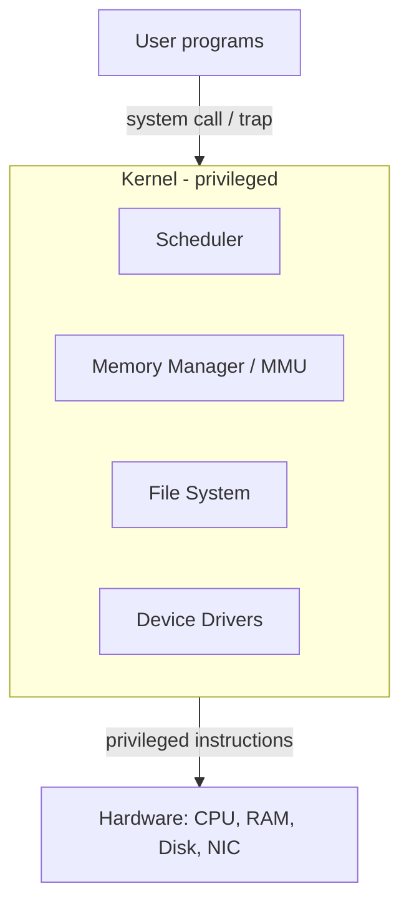

# Module 00 — OS Foundations

> **Agent spawn**: `@Memory.md` + `@Prompt.md` + this file + `@NOTES.md`
> **Nav**: Next → [01 Processes & Threads](../01-processes-threads/MODULE.md)

## At a glance
| | |
|---|---|
| Prerequisites | None |
| Duration | ~1 session |
| Exit test | User↔kernel mode + syscall path bina notes ke |

## Visual map

```
mode bit = 1 (USER)  ── trap ──►  mode bit = 0 (KERNEL)
   limited instr                    all instr + I/O
   app crash ≠ system crash         bug here = panic
```
**Mental model (1 line)**: OS = (1) **resource manager** (CPU/mem/disk baant-ta hai) + (2) **abstraction layer** (hardware ki gandgi chhupata hai), with a protected **kernel** as gatekeeper.

**Redraw challenge**: User→trap→kernel→hardware path + mode bit draw karo.

## Objectives
1. OS ke do roles: resource manager + abstraction
2. Kernel vs user mode + syscall/trap mechanism
3. Interrupts vs polling; boot sequence
4. Kernel architectures: monolithic vs micro vs hybrid

## Topics
- What an OS does; why we need it
- Kernel mode vs user mode, protection rings, dual-mode
- System calls & traps; syscall categories (process, file, device, info, IPC)
- Interrupts (hardware/software) vs polling; interrupt vector
- Boot: BIOS/UEFI → bootloader → kernel → init/systemd
- Monolithic (Linux) vs microkernel (Minix) vs hybrid (Windows/macOS)

## Assignments
| # | Task | Passing criteria |
|---|------|------------------|
| A1 | List 8 syscalls aur category tag karo | Har ek correct category + 1-line kaam |
| A2 | `strace python3 -c "print(1)"` chalao | Top 5 syscalls identify + explain |

## Active recall bank
1. User program directly hardware kyun nahi touch kar sakta?
2. Trap aur interrupt mein difference?
3. Microkernel slow kyun par zyada stable kyun?

## Progress checklist
- [ ] Syscall path diagram from memory
- [ ] A1, A2 done
- [ ] NOTES.md session log updated
