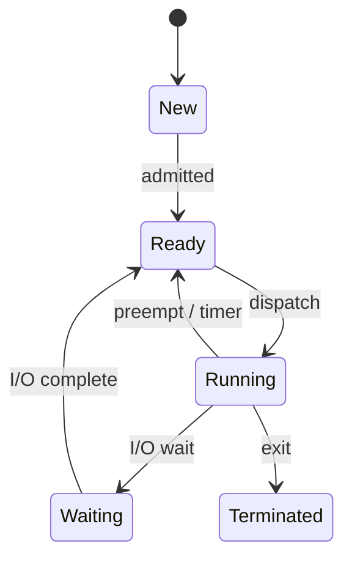

# Module 01 — Processes & Threads

> **Agent spawn**: `@Memory.md` + `@Prompt.md` + this file + `@NOTES.md`
> **Nav**: ← [00 Foundations](../00-foundations/MODULE.md) · Next → [02 CPU Scheduling](../02-cpu-scheduling/MODULE.md)

## At a glance
| | |
|---|---|
| Prerequisites | 00 |
| Duration | ~1–2 sessions |
| Exit test | Process state diagram + zombie/orphan + thread vs process |

## Visual map

```
PROCESS = address space + 1..N threads
 PCB: pid, state, PC, registers, mem maps, open files, priority
 THREADS share: code, data, heap, files
 THREADS own:   stack, registers, PC
```
**Mental model**: Process = container with its own memory; thread = a worker inside sharing that memory. Context switch = CPU ka apni jagah save/restore karna (PCB/TCB).

**Redraw challenge**: Process state machine + "thread share vs own" table bina dekhe.

## Objectives
1. Process vs program vs thread; PCB contents
2. Process states + transitions; context switch cost
3. fork/exec/wait/exit; zombie & orphan
4. User vs kernel threads; 1:1 / M:N; true parallelism in C++ (vs Python's GIL — interview trivia)

## Topics
- Process vs program vs thread; PCB
- States + state diagram; ready/wait queues
- Context switch — kya save hota, kyun mehnga
- `fork()` (COW), `exec()`, `wait()`, `exit()`; zombie/orphan; reaping
- Thread models; thread pool; benefits vs overhead
- Python GIL (interview trivia): CPU-bound threading Python mein bekaar; C++ mein threads truly parallel hote

## Assignments
| # | Task | Passing criteria |
|---|------|------------------|
| A1 | Process state-transition simulator (stub) | Valid transitions allow, invalid reject |
| A2 | `std::thread` (shared mem) vs `fork()` processes benchmark | CPU-bound speedup measured; isolation trade-off explained |
| A3 | Zombie/orphan demo + explanation | Code creates each, you explain reaping |

## Active recall bank
1. Context switch mein exactly kya save/restore hota hai?
2. Zombie kaun reap karta? Orphan kisko adopt hota?
3. fork ke baad COW kaise kaam karta?
4. C++ threads vs processes — kab kaunsa? (Python GIL = trivia)

## Progress checklist
- [ ] State diagram from memory
- [ ] A1–A3 pass
- [ ] NOTES.md updated
