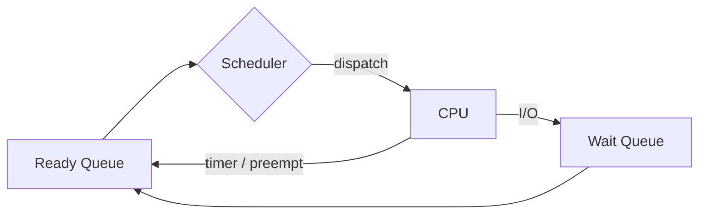

# Module 02 — CPU Scheduling

> **Agent spawn**: `@Memory.md` + `@Prompt.md` + this file + `@NOTES.md`
> **Nav**: ← [01 Processes & Threads](../01-processes-threads/MODULE.md) · Next → [03 Synchronization](../03-synchronization/MODULE.md)

## At a glance
| | |
|---|---|
| Prerequisites | 01 |
| Duration | ~1–2 sessions |
| Exit test | Gantt + waiting time for FCFS/SJF/SRTF/RR by hand |

## Visual map
```
Processes:  P1(0,7) P2(2,4) P3(4,1)   (arrival,burst)

FCFS:  | P1        | P2     | P3 |
RR(q=2): P1 P2 P1 P3 P2 P1 ...  (round-robin slices)

Metrics: turnaround = finish - arrival
         waiting    = turnaround - burst
         response   = first-run - arrival
```

**Mental model**: Scheduler decides "ab kaun chalega". Non-preemptive = chhodega tabhi jab khud rukega; preemptive = beech mein cheen sakte ho (RR, SRTF).

**Redraw challenge**: Ready/CPU/Wait queue cycle + ek Gantt chart.

## Objectives
1. Scheduling criteria + preemptive vs non-preemptive
2. FCFS, SJF, SRTF, Priority (+aging), RR, MLQ, MLFQ
3. Convoy effect, starvation, RR quantum trade-off
4. Linux CFS intuition (vruntime)

## Topics
- Criteria: throughput, turnaround, waiting, response, CPU util
- FCFS (+convoy), SJF/SRTF (optimal avg wait, starvation), Priority (+aging)
- Round Robin (quantum: chhota→overhead, bada→FCFS jaisa)
- Multilevel Queue, MLFQ (feedback, aging)
- CFS: vruntime + red-black tree (intuition)

## Assignments
| # | Task | Passing criteria |
|---|------|------------------|
| A1 | Scheduler sim: FCFS/SJF/RR → Gantt + avg waiting/turnaround (stub) | Matches hand-computed test cases |
| A2 | Add Priority + aging to A1 | No starvation under test; aging visible |

## Active recall bank
1. SJF optimal kyun hai average waiting time ke liye? Catch kya hai?
2. RR quantum bahut chhota → kya problem?
3. Convoy effect kaise hota, kaunse algo mein?
4. MLFQ aging kyun add karta hai?

## Progress checklist
- [ ] Gantt + metrics by hand (4 algos)
- [ ] A1, A2 pass
- [ ] NOTES.md updated
