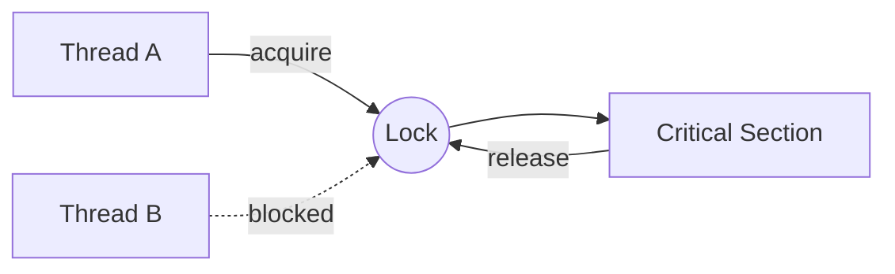

# Module 03 — Synchronization

> **Agent spawn**: `@Memory.md` + `@Prompt.md` + this file + `@NOTES.md`
> **Nav**: ← [02 CPU Scheduling](../02-cpu-scheduling/MODULE.md) · Next → [04 Classic Sync Problems](../04-classic-sync-problems/MODULE.md)

## At a glance
| | |
|---|---|
| Prerequisites | 01 |
| Duration | ~2 sessions |
| Exit test | CS requirements + mutex vs semaphore + CAS |

## Visual map
```
Race: two threads do  count = count + 1   (read-modify-write)
  T1 read 5 ──┐
  T2 read 5 ──┤  both write 6  →  lost update! (chahiye 7)

Critical Section:
  lock.acquire()  ← only one inside
     count += 1   ← protected
  lock.release()
```

**Mental model**: Shared mutable state + concurrency = race. Fix = mutual exclusion around critical section. Mutex = ownership (jisne lock liya wahi chhodega); semaphore = counter (N permits).

**Redraw challenge**: Lost-update race timeline + critical section with lock.

## Objectives
1. Race condition + 3 CS requirements (mutual excl, progress, bounded wait)
2. Peterson + hardware atomics (TAS, CAS)
3. Mutex vs semaphore vs monitor/condition variable
4. Spinlock vs blocking; priority inversion

## Topics
- Race condition, critical section problem
- Peterson's solution (2-process); why software-only is limited
- Hardware: test-and-set, compare-and-swap, atomic ops
- Mutex (ownership) vs semaphore (binary/counting)
- Monitors + condition variables; wait/signal
- Spinlock vs blocking lock; busy-wait cost
- Priority inversion + priority inheritance (Mars Pathfinder)

## Assignments
| # | Task | Passing criteria |
|---|------|------------------|
| A1 | Show a race on a shared counter (threads), then fix with Lock | Buggy version flaky, fixed always correct |
| A2 | Build counting semaphore from Lock+Condition (stub) | acquire/release correct under N permits, no busy-wait |
| A3 | Bounded buffer with Condition | No lost/duplicate items in stress test |

## Active recall bank
1. 3 critical-section requirements?
2. Mutex vs binary semaphore — ownership ka farak?
3. CAS se lock-free counter kaise?
4. Priority inversion kya, inheritance se kaise fix?

## Progress checklist
- [ ] CS requirements + mutex/sem from memory
- [ ] A1–A3 pass
- [ ] NOTES.md updated
