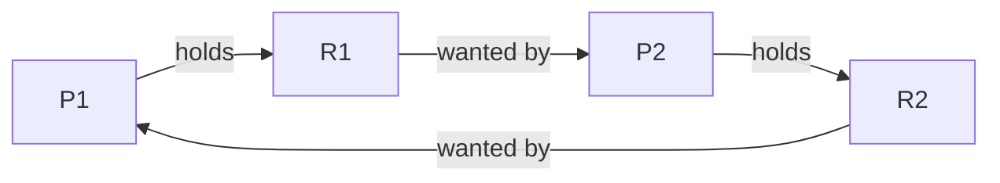

# Module 05 — Deadlocks

> **Agent spawn**: `@Memory.md` + `@Prompt.md` + this file + `@NOTES.md`
> **Nav**: ← [04 Classic Sync Problems](../04-classic-sync-problems/MODULE.md) · Next → [06 Memory Management](../06-memory-management/MODULE.md)

## At a glance
| | |
|---|---|
| Prerequisites | 03 |
| Duration | ~1–2 sessions |
| Exit test | 4 conditions + Banker's safe sequence |

## Visual map

```
4 COFFMAN CONDITIONS (all must hold):
  1. Mutual Exclusion   resource non-shareable
  2. Hold & Wait        hold one, wait for another
  3. No Preemption      can't force-take
  4. Circular Wait      cycle in wait-for graph
break ANY one → no deadlock
```
**Mental model**: Deadlock = cycle in resource allocation graph jahan sab ek-doosre ka resource maang rahe hain. Banker's = "loan tabhi do jab safe sequence bache".

**Redraw challenge**: A cyclic RAG + the 4 conditions list.

## Objectives
1. 4 Coffman conditions + RAG cycle detection
2. Prevention (break each), Avoidance (Banker's, safe state)
3. Detection + recovery; ostrich algorithm
4. Deadlock vs livelock vs starvation

## Topics
- Coffman conditions; resource allocation graph
- Prevention: break each condition (trade-offs)
- Avoidance: safe vs unsafe state, Banker's algorithm
- Detection (wait-for graph) + recovery (kill/preempt/rollback)
- Livelock, starvation differences

## Assignments
| # | Task | Passing criteria |
|---|------|------------------|
| A1 | Detect deadlock via cycle detection in RAG (stub) | Correctly flags cyclic vs acyclic test cases |
| A2 | Banker's algorithm safety check (stub) | Returns safe sequence or "unsafe" for given test cases |

## Active recall bank
1. 4 conditions + har ek break karne ka tareeka?
2. Safe state ≠ deadlock-free abhi — kyun avoidance conservative hai?
3. Connection pool deadlock (CV hook) kaise hota?

## Progress checklist
- [ ] 4 conditions + Banker's by hand
- [ ] A1, A2 pass
- [ ] NOTES.md updated
