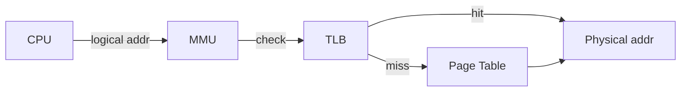

# Module 06 — Memory Management

> **Agent spawn**: `@Memory.md` + `@Prompt.md` + this file + `@NOTES.md`
> **Nav**: ← [05 Deadlocks](../05-deadlocks/MODULE.md) · Next → [07 Virtual Memory](../07-virtual-memory/MODULE.md)

## At a glance
| | |
|---|---|
| Prerequisites | 01 |
| Duration | ~1–2 sessions |
| Exit test | Logical→physical translation + TLB EAT |

## Visual map
```
logical address (e.g. 16-bit, page size 4KB):
  [ page number (4 bits) | offset (12 bits) ]
            │                    │
            ▼                    │
       page table  ──► frame#    │
            │                    │
            ▼                    ▼
physical:  [ frame number | offset ]

TLB: cache of recent page→frame  →  hit = fast, miss = walk page table
```

**Mental model**: Paging = memory ko fixed blocks (frames) mein todo, process ke pages kahin bhi rakho → external fragmentation khatam, thoda internal bachta hai. TLB = translation ka cache.

**Redraw challenge**: Logical→physical split + TLB hit/miss path.

## Objectives
1. Address binding + logical vs physical + MMU
2. Contiguous allocation + fragmentation
3. Paging: page table, frame, offset
4. TLB + EAT; multilevel & inverted page tables; segmentation

## Topics
- Address binding (compile/load/exec); logical vs physical
- Contiguous: first/best/worst fit; external + internal fragmentation
- Paging: page#/offset, frame, page table
- TLB: hit ratio, effective access time
- Multilevel & inverted page tables (why)
- Segmentation; segmentation + paging

## Assignments
| # | Task | Passing criteria |
|---|------|------------------|
| A1 | logical→physical translator given page size + table (stub) | Correct frame+offset for test addresses |
| A2 | EAT calculator (TLB hit ratio, access times) | Matches formula on test inputs |

## Active recall bank
1. Internal vs external fragmentation — kaunsa paging mein?
2. EAT formula likho (with TLB)?
3. Multilevel page table kyun (memory bachat)?

## Progress checklist
- [ ] Translation + EAT by hand
- [ ] A1, A2 pass
- [ ] NOTES.md updated
