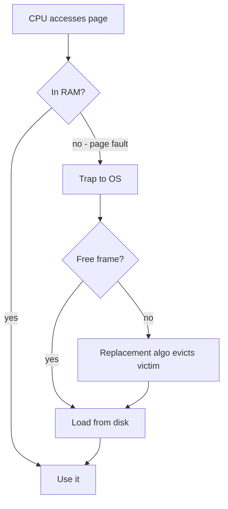

# Module 07 — Virtual Memory

> **Agent spawn**: `@Memory.md` + `@Prompt.md` + this file + `@NOTES.md`
> **Nav**: ← [06 Memory Management](../06-memory-management/MODULE.md) · Next → [08 File Systems](../08-file-systems/MODULE.md)

## At a glance
| | |
|---|---|
| Prerequisites | 06 |
| Duration | ~2 sessions |
| Exit test | Page-fault path + FIFO/LRU/Optimal counts + Belady |

## Visual map

```
Reference string: 1 2 3 4 1 2 5 ...
FIFO   → evict oldest-loaded   (Belady's anomaly: more frames, MORE faults!)
LRU    → evict least-recently-used
Optimal→ evict farthest-future (best, not implementable)
Clock  → LRU approx with reference bit
```
**Mental model**: Saari memory disk pe rehti hai, sirf zaroori pages RAM mein (demand paging). Fault = "page nahi mila, disk se laao". Replace karna pade toh kis page ko nikaalo = replacement algorithm.

**Redraw challenge**: Page-fault flowchart + a reference string fault count.

## Objectives
1. Demand paging + full page-fault handling
2. Replacement: FIFO (+Belady), Optimal, LRU, Clock
3. Thrashing + working set; frame allocation
4. COW, memory-mapped files

## Topics
- Demand paging; page fault path (trap→find→load→restart)
- FIFO + Belady's anomaly; Optimal; LRU + approximations (clock/second-chance, aging); LFU
- Frame allocation: equal/proportional; global vs local
- Thrashing; working set model; page-fault frequency
- Copy-on-write; memory-mapped files

## Assignments
| # | Task | Passing criteria |
|---|------|------------------|
| A1 | Page-replacement simulator (FIFO/LRU/Optimal) → fault count (stub) | Matches hand counts; demonstrates Belady on FIFO |
| A2 | Working-set window computation | Correct WS size over reference string |

## Active recall bank
1. Page fault ke poore steps?
2. Belady's anomaly kis algo mein, kyun?
3. Thrashing kaise detect + fix (working set)?

## Progress checklist
- [ ] Fault path + 3 algos by hand
- [ ] A1, A2 pass
- [ ] NOTES.md updated
