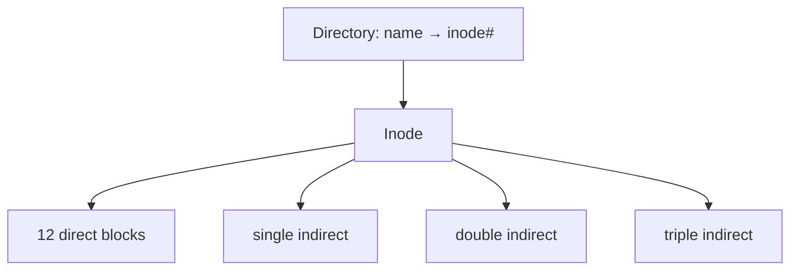

# Module 08 — File Systems

> **Agent spawn**: `@Memory.md` + `@Prompt.md` + this file + `@NOTES.md`
> **Nav**: ← [07 Virtual Memory](../07-virtual-memory/MODULE.md) · Next → [09 Disk & I/O](../09-disk-io-scheduling/MODULE.md)

## At a glance
| | |
|---|---|
| Prerequisites | 06 |
| Duration | ~1 session |
| Exit test | inode max-size calc + hard/soft link + journaling |

## Visual map
```
inode (fixed-size metadata + pointers):
  [ owner | perms | size | timestamps ]
  direct[0..11] ─────────► data blocks
  single indirect ─► block of pointers ─► data
  double indirect ─► ptr→ptr→data
  triple indirect ─► ptr→ptr→ptr→data
max size = (12 + N + N^2 + N^3) * blockSize,  N = ptrs per block
```

**Mental model**: Directory = naam→inode number ka mapping. inode = file ka metadata + data block pointers. Hard link = same inode ka doosra naam; soft link = naya inode jo path store karta hai.

**Redraw challenge**: inode pointer scheme + directory→inode mapping.

## Objectives
1. File ops, directory structures
2. Allocation: contiguous/linked/indexed (inode)
3. inode pointers + max file size; free-space mgmt
4. Journaling; hard vs soft links; VFS

## Topics
- File attributes, operations; directory structures (tree, acyclic graph)
- Allocation: contiguous (fragmentation), linked (FAT), indexed (inode)
- inode: direct/indirect pointers; max file size
- Free space: bitmap vs linked list
- Journaling (redo/undo, crash consistency); hard vs soft link
- ext4/NTFS/FAT overview; VFS layer

## Assignments
| # | Task | Passing criteria |
|---|------|------------------|
| A1 | Max file size from inode scheme (stub) | Correct for given block size + ptr counts |
| A2 | Hard vs soft link demo (`link()`, `symlink()` syscalls or `ln`/`ln -s`) | Show inode shared vs new; delete-target behaviour explained |

## Active recall bank
1. inode max file size formula?
2. Hard link vs soft link — target delete hone pe kya hota?
3. Journaling crash ke baad consistency kaise deta?

## Progress checklist
- [ ] inode diagram + max-size by hand
- [ ] A1, A2 done
- [ ] NOTES.md updated
