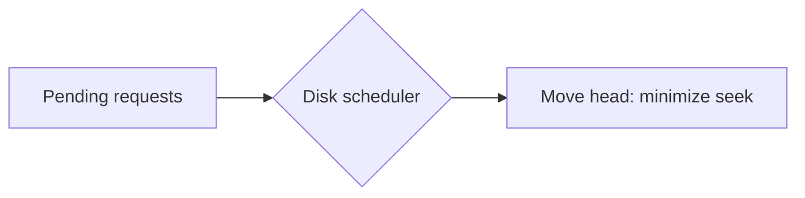

# Module 09 — Disk & I/O Scheduling

> **Agent spawn**: `@Memory.md` + `@Prompt.md` + this file + `@NOTES.md`
> **Nav**: ← [08 File Systems](../08-file-systems/MODULE.md) · Next → [10 IPC](../10-ipc/MODULE.md)

## At a glance
| | |
|---|---|
| Prerequisites | 08 |
| Duration | ~1 session |
| Exit test | Head movement for SSTF/SCAN/C-SCAN by hand |

## Visual map
```
Disk head at 53. Requests: 98 183 37 122 14 124 65 67

FCFS : 53→98→183→37→...        (lots of back-and-forth)
SSTF : nearest first           (starvation risk)
SCAN : sweep one way to end, reverse (elevator)
C-SCAN: sweep one way, jump back to 0, sweep again (uniform wait)
LOOK / C-LOOK: like SCAN but only go as far as last request
```

**Mental model**: Seek time = head ko sahi track tak le jaana (sabse mehnga). Algorithms head movement minimize/fair karne ke liye. SSD mein seek nahi → ye algos HDD-specific.

**Redraw challenge**: SCAN vs C-SCAN sweep on a number line.

## Objectives
1. HDD geometry: seek, rotational latency, transfer
2. Disk scheduling: FCFS/SSTF/SCAN/C-SCAN/LOOK/C-LOOK + head movement
3. RAID 0/1/5/6/10 trade-offs
4. SSD vs HDD; I/O models; DMA

## Topics
- Seek/rotational/transfer time; access time
- FCFS, SSTF (starvation), SCAN/C-SCAN, LOOK/C-LOOK; total head movement
- RAID levels: striping/mirroring/parity; RAID5 vs RAID10
- SSD: no seek, wear leveling, TRIM
- I/O: blocking/non-blocking/async; page cache; DMA

## Assignments
| # | Task | Passing criteria |
|---|------|------------------|
| A1 | Disk scheduling simulator → total head movement (stub) | Matches hand calc for FCFS/SSTF/SCAN/C-SCAN |

## Active recall bank
1. SCAN vs C-SCAN — C-SCAN fair kyun?
2. SSTF mein starvation kaise?
3. RAID 5 vs RAID 10 — write performance + redundancy?

## Progress checklist
- [ ] Head movement by hand (4 algos)
- [ ] A1 pass
- [ ] NOTES.md updated
