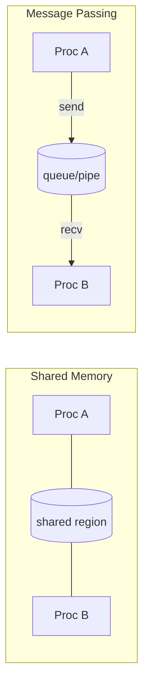

# Module 10 — Inter-Process Communication (IPC)

> **Agent spawn**: `@Memory.md` + `@Prompt.md` + this file + `@NOTES.md`
> **Nav**: ← [09 Disk & I/O](../09-disk-io-scheduling/MODULE.md) · Next → [11 Linux + Interview](../11-linux-practical-interview/MODULE.md)

## At a glance
| | |
|---|---|
| Prerequisites | 01 |
| Duration | ~1 session |
| Exit test | Shared mem vs message passing + SIGKILL vs SIGTERM |

## Visual map

```
Shared memory: fast (no copy) but YOU sync (mutex/sem)
Message passing: safe, OS-managed, copies data (slower)
Signals: async notifications (SIGTERM catchable, SIGKILL not)
```
**Mental model**: Processes alag address space rakhte hain → baat karne ke liye ya toh shared region (fast, khud sync karo) ya OS ke through messages (safe, copy hota hai). CV hook: Kafka/Redis pub-sub = network message passing.

**Redraw challenge**: Shared memory vs message passing side-by-side.

## Objectives
1. Shared memory vs message passing trade-offs
2. Pipes (anon/named), message queues, sockets
3. Signals + handlers; graceful shutdown
4. Sync vs async messaging (→ Kafka bridge)

## Topics
- Shared memory (+ needs own sync); message passing
- Pipes: anonymous vs named (FIFO); message queues
- Sockets: Unix domain vs network
- Signals: SIGINT/SIGTERM/SIGKILL/SIGSEGV; handlers; un-catchable signals
- Synchronous vs async; (bridge: outbox/Kafka exactly-once)

## Assignments
| # | Task | Passing criteria |
|---|------|------------------|
| A1 | Cross-process producer/consumer via `multiprocessing.Queue`/`Pipe` | No data loss; clean shutdown |
| A2 | Signal handler for graceful shutdown (SIGTERM) | Cleans up resources, ignores or handles correctly |

## Active recall bank
1. Shared memory fast par catch kya?
2. SIGKILL kyun catch nahi hota?
3. Named vs anonymous pipe — kab kaunsa?

## Progress checklist
- [ ] Shared mem vs message passing from memory
- [ ] A1, A2 done
- [ ] NOTES.md updated
