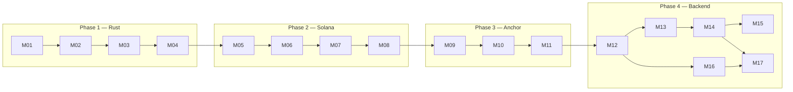
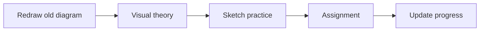

# Solana + Rust Backend — Learning Home

> [!tip] Aaj kya karna hai
> 1. [[learning-progress|Progress]] kholo — active module dekho
> 2. Neeche **Continue learning** link pe click karo
> 3. Cursor agent: us module ka [[modules/phase-1-rust/01-ownership-borrowing/agent|Agent prompt]] paste karo

---

## Continue learning

| | |
|---|---|
| **Active module** | M01 — Ownership & Borrowing |
| **Phase** | P1 — Rust essentials |
| **Status** | IN PROGRESS |
| **Open module hub** | [[modules/phase-1-rust/01-ownership-borrowing/Hub\|M01 Hub →]] |
| **Agent file** | [[modules/phase-1-rust/01-ownership-borrowing/agent\|M01 Agent]] |

> [!note] Progress update
> Har session ke baad [[learning-progress|learning-progress]] edit karo — Obsidian mein yahi tumhara live dashboard hai.

---

## Quick links

| Link | Kya hai |
|------|---------|
| [[learning-progress\|📊 Progress tracker]] | Gates, weaknesses, recall schedule, session log |
| [[modules/Index\|📚 All modules]] | 17 modules — full curriculum map |
| [[modules/_shared/RECALL-BANK\|🧠 Recall bank]] | Spaced repetition quiz items |
| [[modules/_shared/LEARNING-SYSTEM\|⚙️ Learning system]] | Active recall + spacing rules |
| [[modules/_shared/VISUAL-LEARNING\|🎨 Visual learning]] | Diagrams-first guide (your style) |
| [[modules/_shared/ANTI-OVERFITTING\|🎯 Anti-overfitting]] | Transfer tests — don't memorize examples |
| [[modules/_shared/AGENT-PROTOCOL\|🤖 Agent protocol]] | Har module agent ke liye |
| [[OBSIDIAN-SETUP\|🗂️ Obsidian setup]] | Vault kaise kholein |
| [[Prompt\|💬 Cursor tutor prompt]] | Legacy full prompt (optional) |

---

## Curriculum map



### Phase 1 — Rust essentials

| Module | Hub | Gate |
|--------|-----|------|
| M01 Ownership & Borrowing | [[modules/phase-1-rust/01-ownership-borrowing/Hub\|Hub]] | G01 |
| M02 Result & Option | [[modules/phase-1-rust/02-result-option-errors/Hub\|Hub]] | G02 |
| M03 Structs, Enums & Traits | [[modules/phase-1-rust/03-structs-enums-traits/Hub\|Hub]] | G03 |
| M04 Async & Tokio | [[modules/phase-1-rust/04-async-tokio-grpc/Hub\|Hub]] | G04 |

### Phase 2 — Solana mental model

| Module | Hub | Gate |
|--------|-----|------|
| M05 Account model | [[modules/phase-2-solana/01-account-model/Hub\|Hub]] | G05 |
| M06 Transactions & instructions | [[modules/phase-2-solana/02-transactions-instructions/Hub\|Hub]] | G06 |
| M07 PDAs, rent & lamports | [[modules/phase-2-solana/03-pdas-rent-lamports/Hub\|Hub]] | G07 |
| M08 Commitment & compute | [[modules/phase-2-solana/04-commitment-compute/Hub\|Hub]] | G08 |

### Phase 3 — Anchor

| Module | Hub | Gate |
|--------|-----|------|
| M09 Read Anchor programs | [[modules/phase-3-anchor/01-read-anchor-programs/Hub\|Hub]] | G09 |
| M10 Constraints & IDL | [[modules/phase-3-anchor/02-accounts-constraints-idl/Hub\|Hub]] | G10 |
| M11 Write small program | [[modules/phase-3-anchor/03-write-small-program/Hub\|Hub]] | G11 |

### Phase 4 — Backend (main event)

| Module | Hub | Gate |
|--------|-----|------|
| M12 RPC vs streaming | [[modules/phase-4-backend/01-rpc-vs-streaming/Hub\|Hub]] | G12 |
| M13 Yellowstone gRPC | [[modules/phase-4-backend/02-yellowstone-grpc/Hub\|Hub]] | G13 |
| M14 Indexer (Node) | [[modules/phase-4-backend/03-indexer-node/Hub\|Hub]] | G14 |
| M15 Indexer (Rust) | [[modules/phase-4-backend/04-indexer-rust/Hub\|Hub]] | G15 |
| M16 Tx lifecycle | [[modules/phase-4-backend/05-tx-lifecycle/Hub\|Hub]] | G16 |
| M17 Reconciliation | [[modules/phase-4-backend/06-reconciliation/Hub\|Hub]] | G17 |

---

## Target projects

| Project | Modules |
|---------|---------|
| **Indexer** | M12 → M15 |
| **Tx service** | M08, M16 |
| **Reconciliation** | M14, M17 |

---

## Toolchain

| Tool | Required | Status |
|------|----------|--------|
| rustc | 1.85+ | ✅ 1.88.0 |
| node | for M14 | ✅ v22.12.0 |
| solana | 3.x | ⚠️ 2.2.21 — upgrade before M11 |
| anchor | 1.0+ | ❌ install before M09 |

---

## Session flow (har baar)



1. **Redraw** — purane module ka diagram memory se (`attachments/sketches/`)
2. **Visual theory** — module **Visual map** section ([[modules/_shared/VISUAL-LEARNING|guide]])
3. **Sketch-first practice** — diagram pehle, code baad
4. **Assignment**
5. **Update** — [[learning-progress|progress]] + sketch photo link

---

## Visual learner

> [!abstract] Tumhara learning style
> **Diagram pehle, code baad.** Har module Theory note mein mermaid + ASCII hai.  
> Full guide: [[modules/_shared/VISUAL-LEARNING|Visual learning]]

| Tool | Use |
|------|-----|
| Paper → photo | Gate exams, cold recall |
| Obsidian Canvas | Hub se linked maps |
| `attachments/sketches/` | M01-ownership.png etc. |

---

## Cursor agent quick-start

```
You are the dedicated agent for module M01.
Read: modules/_shared/AGENT-PROTOCOL.md, modules/_shared/LEARNING-SYSTEM.md,
      modules/phase-1-rust/01-ownership-borrowing/agent.md,
      modules/phase-1-rust/01-ownership-borrowing/MODULE.md,
      learning-progress.md
Gate before advancing. Socratic only.
```

> [!warning] Obsidian wikilinks
> Cursor mein file path use karo (`@modules/.../agent.md`). Obsidian mein Hub notes se navigate karo — dono same files hain.
