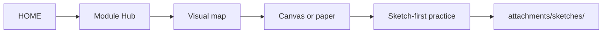

# Obsidian setup

> [!nav] Navigation
> [[HOME|Home]] · [[modules/Index|All modules]] · [[learning-progress|Progress]]

## Vault open karo

1. Obsidian kholo → **Open folder as vault**
2. Folder select karo: `Web3/Solana/Rust` (yeh repo root)
3. **HOME** note pin karo (right-click → Pin)

Vault root = `Rust/` folder. Saari curriculum notes yahi hain.

## Recommended plugins (optional)

| Plugin | Kyun |
|--------|------|
| **Homepage** | Startup pe `HOME` khule |
| **Spaced Repetition** | `RECALL-BANK` items flashcard style |
| **Templater** | Session log template |

| **Excalidraw** | Account boxes, tx layout, state machines |
| **Canvas** | Module visual maps — Hub se new canvas |

Built-in **Graph view** se `tag:#solana-curriculum` filter karo — poora curriculum graph dikhega.

## Visual learner workflow

> [!abstract] Diagram pehle, code baad
> Full guide: [[modules/_shared/VISUAL-LEARNING|Visual learning]]

- Split pane: Theory left, Canvas right
- Sketches: `attachments/sketches/M01-ownership.png`
- Embed: `![[attachments/sketches/M05-accounts.png]]`
- Gate pe: diagram memory se redraw → photo save → link in [[learning-progress|progress]]

## Obsidian-safe conventions (yeh repo follow karta hai)

- **Wikilinks** for navigation: `[[HOME]]`, `[[learning-progress|Progress]]`
- **YAML frontmatter** on every note — tags, module id, aliases
- **Hub notes** per module — ek jagah se theory + practice + assignments + agent
- **No wiki links inside code blocks** — Rust code Obsidian break nahi karega
- **Pipe in links escaped** — table cells use `\|` where needed
- **Underscore folders** (`_shared`) — Obsidian mein kaam karte hain; hide nahi hote unless plugin

## File map

| Obsidian mein kholo | Cursor mein reference |
|---------------------|----------------------|
| [[HOME]] | start here |
| [[modules/phase-1-rust/01-ownership-borrowing/Hub\|M01 Hub]] | `@modules/phase-1-rust/01-ownership-borrowing/` |
| [[modules/phase-1-rust/01-ownership-borrowing/agent\|M01 Agent]] | paste in chat |

## Daily workflow

1. Open **HOME** → Continue learning
2. **Hub** → open **Visual map** in Theory — copy to Canvas/paper
3. Practice — sketch first, then answer
4. Cursor: **Agent** note
5. Save sketch → `attachments/sketches/` → link in **learning-progress**

## Graph tags

- `#solana-curriculum` — sab notes
- `#phase-1` … `#phase-4` — phase filter
- `#m01` … `#m17` — per module
- `#recall` — spaced repetition items
- `#visual` — visual learning meta (if tagged)
