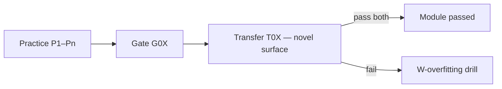

> [!nav] Navigation
> [[HOME|Home]] · [[modules/_shared/LEARNING-SYSTEM|Learning system]] · [[learning-progress|Progress]]

# Anti-overfitting — generalize, don't memorize

> [!warning] Primary weakness
> Tum **exact practice problem / diagram shape yaad kar lete ho**, lekin **naye case mein blank** ho jata ho. Curriculum isko actively counter karta hai.

### Learner signature (confirmed)

| Works | Breaks |
|-------|--------|
| Seen practice / familiar diagram | Novel names, types, or scenario |
| Repeat back example | Apply same *rule* to unfamiliar surface |

**Fix order:** rule sentence (1 line) → backend analog → *then* diagram → *then* code. Surface pehle = overfit trap.

## Signal vs noise

| Noise (mat yaad karo) | Signal (yeh retain karo) |
|------------------------|--------------------------|
| Variable names `s`, `name`, `vansh` | Rule: move = owner transfer |
| Exact diagram layout colors | Invariant: one owner, many `&T` OR one `&mut` |
| Practice problem number P3 answer | *Why* compiler said no |
| Anchor example program name | Constraint category: signer / mut / seeds |

**Agent rule:** agar tum example word-for-word repeat karo bina *kyun* ke → `W-overfitting` tag.

## Transfer test (har gate pe mandatory)

Gate pass = **original gate problem** + **transfer variant** (agent-generated, notes mein nahi).

**Transfer examples:**

| Module | Memorized | Transfer (same rule) |
|--------|-----------|----------------------|
| M01 | `String` move | `Vec<u8>` move — kya Copy? |
| M05 | "token account 165 bytes" | new account type: *which field decides owner?* |
| M06 | SOL transfer layout | SPL transfer — signers same rule, accounts different |
| M14 | gap at slot 103 | gap at slot 8871 — same fix, no hints |

## Agent must do

1. **Never** accept gate pass on memorized answer alone — ask: *"Agar `String` ki jagah `HashMap` ho?"*
2. End each session with **1 transfer question** (not in `practice.md`)
3. **Interleave** — 2+ topics ek session mein jab overfitting risk ho
4. **Principle explain-back:** rule bolo **without** naming today's problem
5. **No answer matching** — agar tumne P2 jaisa suna, agent rephrase kare

## Tum kya karo

| Technique | Action |
|-----------|--------|
| **Blank paper** | Same idea, apne words + apne variable names |
| **Teach alien** | "Imagine maine yeh problem kabhi nahi dekha" — explain |
| **Invert** | "Kab fail *nahi* hoga?" — edge case |
| **Backend port** | Har pattern → indexer/tx mein *different* example |

## Weakness bucket: `W-overfitting`

| Signal | Fix |
|--------|-----|
| Practice perfect, transfer fail | 3 transfer drills, same session |
| Diagram redraw OK, new scenario fail | label chhodo, sirf rule likho |
| "P3 waala answer" bolna | agent forces novel numbers/names |
| Gate pass then +1d fail cold | drop recall 2 levels + transfer only |

Track count in [[learning-progress|learning-progress]]. **2+ transfer fails** → gate **revoked** until transfer pass.

## Gate wording change

Har module gate ab:

- [ ] Original gate (G0X)
- [ ] **Transfer gate (T0X)** — agent-generated variant
- [ ] **Principle explain-back** — no reference to practice problem IDs

## Visual learner + overfitting

Diagram **shape** yaad karna ≠ samajhna.

- Redraw diagram with **different labels** (not `s` / `name`)
- Agent: "is diagram ka rule kya hai agar boxes badal doon?"
- `W-visual-gap` + `W-overfitting` together → rule sentence pehle, diagram baad

## Spaced recall (transfer mode)

RECALL-BANK level L3+ = **rephrase only**, never same prompt twice in a row.

Agent logs: `R01-transfer-2026-06-24` style variants in session log.
