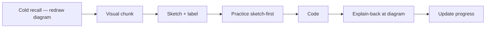

> [!nav] Navigation
> [[HOME|Home]] · [[modules/Index|All modules]] · [[learning-progress|Progress]]

# Learning System — Active recall, spacing, diagnosis

Yeh curriculum sirf "padhna" nahi — **retain karna** aur **weakness fix karna** design hai.

> [!info] Visual learner
> Tum strong **visual learner** ho. Har session [[modules/_shared/VISUAL-LEARNING|Visual learning guide]] follow karo: **diagram pehle, code baad mein**.

## Core loop (har session)

## Active learning (agent must enforce)

| Technique | Kya karna hai | Kab |
|-----------|---------------|-----|
| **Retrieval practice** | Pehle answer maango, phir theory | Session start, har naya concept |
| **Elaboration** | "Backend mein iska analog kya?" | Har pattern tag ke baad |
| **Concrete → abstract** | Numbers pehle (lamports, CU, slots) | Solana modules mandatory |
| **Interleaving** | Purane module ka 1 question naye topic ke saath | Session start recall |
| **Generation** | Learner code likhe, agent edit na kare jab tak 2 attempts | Practice + assignments |
| **Explain-back** | Learner 60-sec verbal/written explanation | Gate se pehle mandatory |
| **Dual coding** | Diagram + Hinglish sentence same idea | Har pattern tag ke baad |
| **Sketch-first** | Empty boxes draw, phir fill — code last | Practice + assignments |
| **Redraw recall** | Purana module diagram bina dekhe | Session start + spaced gates |
| **Transfer test** | Same rule, novel surface — not in practice.md | Every gate + session end |
| **Interleaving** | 2 topics mixed when `W-overfitting` risk | After 2nd practice pass same day |

> [!warning] Primary weakness: overfitting
> See [[modules/_shared/ANTI-OVERFITTING|Anti-overfitting guide]]. Gate = original **+ transfer variant**. Memorized answer ≠ pass.

## Spaced repetition schedule

Har `RECALL-BANK` item ke levels:

| Level | Interval | Action |
|-------|----------|--------|
| L0 | New | Add after first teach |
| L1 | +1 day | Cold quiz |
| L2 | +3 days | Cold quiz, no hints |
| L3 | +7 days | Re-solve mini problem |
| L4 | +14 days | Re-solve from scratch, no notes |
| L5 | +30 days | Interleaved capstone question |

**Fail** → drop 2 levels. **Pass with struggle** → same level. **Pass clean** → +1 level.

Agent `learning-progress.md` → Cold quiz rotation table update kare.

## Weakness diagnosis buckets

Har galat attempt ko tag karo (multiple allowed):

| Bucket | Signal | Fix |
|--------|--------|-----|
| `W-ownership` | move/borrow confusion | M01 drills |
| `W-lifetime` | `'a` errors, dangling refs | M01 P7–P8 |
| `W-error-handling` | unwrap abuse, `?` misuse | M02 |
| `W-types` | enum/struct/trait confusion | M03 |
| `W-async` | blocking, race, channel misuse | M04 |
| `W-account-model` | "program stores state" mental model | M05 |
| `W-tx-layout` | signer/writable order wrong | M06 |
| `W-pda` | seed/bump confusion | M07 |
| `W-commitment` | processed vs finalized mix | M08 |
| `W-anchor-accounts` | constraint errors | M10 |
| `W-streaming` | poll vs push wrong tool | M12 |
| `W-indexer` | gaps, dedup, reorg | M14–M15 |
| `W-tx-lifecycle` | blockhash, retry idempotency | M16 |
| `W-visual-gap` | words OK, layout bhool jata | redraw visual 3× |
| `W-layout` | sequence/order wrong in diagrams | ASCII numbered drill |
| `W-spatial` | "kahan rehta hai" confusion | box + arrow exercises |
| `W-overfitting` | practice perfect, transfer/novel fail; recites example not rule | transfer drills + principle explain-back |

`learning-progress.md` mein weakness counts track karo — 3+ same bucket → agent extra drill assign kare, aage mat badho. **`W-overfitting` × 2 transfer fail → gate revoked.**

## Problem design rules

Har practice problem mein hona chahiye:

1. **Teaches** — ek narrow skill
2. **Diagnoses** — common wrong answer documented in module file
3. **Repairs** — follow-up micro-drill if wrong

Assignments = integrate 2–3 skills + connect to indexer/tx/reconciliation project.

## Gate vs completion

- **Practice done** ≠ module done
- **Gate** = explain-back pass + gate problem without hints + recall item L2+ + **transfer variant pass (T0X)**
- Transfer rules: [[modules/_shared/ANTI-OVERFITTING|Anti-overfitting]]

Agent learner ko next module pe **nahi** bhej sakta jab tak gate unchecked hai.
