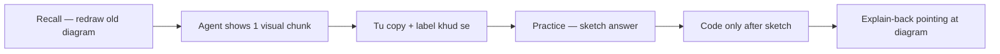

> [!nav] Navigation
> [[HOME|Home]] · [[modules/_shared/LEARNING-SYSTEM|Learning system]] · [[learning-progress|Progress]]

# Visual learning guide

Tum **strong visual learner** ho — is curriculum ko iske around design kiya gaya hai.

> [!abstract] Core rule
> **Pehle diagram, phir code, phir words.** Agar diagram nahi bana sakte, abhi code mat likho.

## Visual session loop

| Step | Kya karo | Time |
|------|----------|------|
| 1. **Redraw** | Purane module ka 1 diagram bina dekhe | 3 min |
| 2. **See** | Theory note ka mermaid / ASCII dekho | 2 min |
| 3. **Copy** | Obsidian canvas, paper, ya Excalidraw pe khud labels lagao | 5 min |
| 4. **Sketch-first** | Practice se pehle empty box banao, fill karo | har problem |
| 5. **Dual-code** | Diagram + 1 sentence Hinglish | explain-back |

## Tools (pick one stack)

| Tool | Best for |
|------|----------|
| **Paper + photo** | Cold recall, gate exams — `attachments/sketches/` mein save |
| **Obsidian Canvas** | Module visual maps link karna — Hub se new canvas |
| **Excalidraw** (Obsidian plugin) | Tx layout, account boxes, state machines |
| **Mermaid** (in notes) | Agent-generated; tu edit karke apna version bana |

Sketches save path: `attachments/sketches/M0X-description.png`

## Agent rules (visual)

Agent **must**:

1. Har naya concept **diagram se** shuru kare — paragraph se nahi
2. Practice se pehle bole: *"Pehle sketch banao, phir answer"*
3. Galat answer pe diagram dubara draw karwaye — text explain kam
4. Gate pass tab jab tu **diagram from memory** bana sako (photo ya canvas link `learning-progress` mein)
5. Tables + color-coded callouts use kare (`[!info]`, `[!warning]`)

Agent **must not**:

- Long prose dump without a visual anchor
- Code likhwaye jab tak sketch attempt na ho (2 sketch attempts for hard problems)

## Visual weakness bucket

| Bucket | Signal | Fix |
|--------|--------|-----|
| `W-visual-gap` | Words samajh aa rahe, layout yaad nahi | Redraw module visual 3x spaced |
| `W-layout` | Order/sequence galat (tx accounts, pipeline) | ASCII + numbered arrows drill |
| `W-spatial` | PDA/ownership "kahan rehta hai" confuse | Box diagrams with arrows |

Track in [[learning-progress|learning-progress]].

## Module visual index

Har `MODULE.md` mein **Visual map** section hai — gate se pehle woh redraw karo.

| Module | Visual focus |
|--------|----------------|
| M01 | Stack/heap ownership arrows |
| M02 | Option/Result flow |
| M03 | Enum dispatch tree |
| M04 | Tokio tasks + channels |
| M05 | Account box layout |
| M06 | Tx → instructions → accounts |
| M07 | PDA seed tree |
| M08 | Commitment timeline |
| M09 | Anchor project map |
| M10 | Accounts constraint graph |
| M11 | Deploy + IDL flow |
| M12 | Poll vs push |
| M13 | Yellowstone subscribe |
| M14 | Indexer pipeline |
| M15 | Parser/handler split |
| M16 | Tx state machine |
| M17 | Reconciliation loop |

## Obsidian tips

- Graph view: `tag:#visual` filter
- Hub note → **Open in Canvas** → link Theory + sketch
- Image embed: `![[attachments/sketches/M05-accounts.png]]`
- Split pane: Theory left, Canvas right

## Explain-back (visual version)

Gate pe yeh format:

1. Diagram draw (no peeking)
2. Har arrow pe ungli rakh ke 1 line bolo
3. Backend analog 1 box mein likho

Agent scores: **layout correct?** → **labels correct?** → **numbers correct?**
