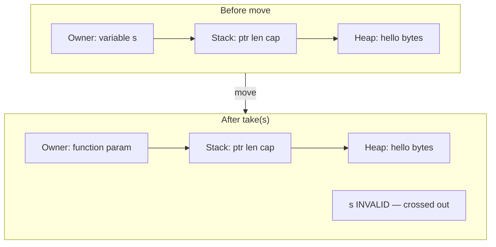
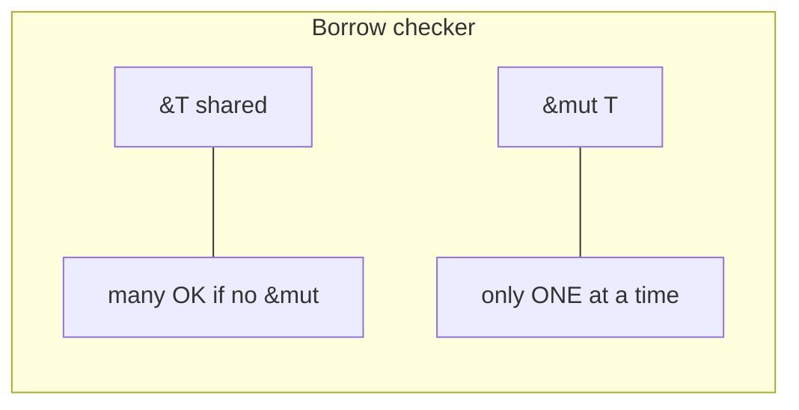

> [!nav] Navigation
> **[[modules/phase-1-rust/01-ownership-borrowing/Hub|M01 Hub]]** · [[HOME|Home]] · [[learning-progress|Progress]] · [[modules/Index|All modules]] · _you are here: Theory_

# M01 — Ownership & Borrowing

**Phase:** 1 | **Prereq:** none | **Unlocks:** M02, M03

## Learning objectives

- Move semantics samajhna — TS reference se difference
- `&T` / `&mut T` rules without memorizing
- Stack copy vs heap move — size intuition
- Lifetimes basics: "jab tak owner zinda, tab tak borrow valid"

## Visual map

> [!abstract] Draw this first
> Paper pe 3 boxes banao: **Owner** → **Stack** → **Heap**. Move = arrow transfer. Borrow = dotted line, owner box same.

### Ownership — move vs borrow

### Borrow rules (one screen)

| Visual | TS mental model | Rust reality |
|--------|-----------------|--------------|
| Solid arrow move | ref copy | ownership transfer |
| Dotted borrow | shared ref | read lease, owner stays |
| Red X on old name | still usable | compile error |

**Sketch gate:** G01 se pehle move/borrow diagram memory se redraw.

## Theory

### 1. Ek value, ek owner

Rust mein har value ka **exactly one owner** hota hai. `let x = y` (non-Copy type) = ownership **move** — `y` invalid.

**Numbers:** `u64` = 8 bytes stack pe — `Copy`. `String` = 24 bytes stack (ptr+len+cap) + heap data — move.

**Backend map:** Move = Kafka message ownership transfer to consumer group — purana handler dubara process nahi kar sakta unless clone.

### 2. Borrowing

- `&T` — kitne bhi shared borrows (jab tak koi `&mut` na ho)
- `&mut T` — **ek hi** active mutable borrow

**Galat mental model:** "TS mein reference pass kiya, sab change kar sakta" — Rust compiler isko block karega agar aliasing + mutation ho.

### 3. Lifetimes (basics)

Lifetime = borrow **kitni der valid**. Mostly compiler infer karta hai. Error tab aata hai jab returned reference kisi local se banta ho.

Indexer map: borrowed account data = stream message view — process karo, store mat karo as dangling ref.

### 4. Clone vs borrow tradeoff

- Borrow: zero-copy read hot path
- Clone: explicit copy cost — 10KB account data × 1000 msgs/sec = real throughput hit

## Gate criteria

- [ ] Explain-back: move vs borrow vs clone — **rule only**, no "P1 waala" reference
- [ ] Gate G01 without hints (`practice.md`)
- [ ] **Transfer T01:** same rule, `Vec<u8>` or `HashMap` instead of `String` — agent generates
- [ ] Recall R01–R04 at L2+ (rephrased prompts)

Transfer rules: [[modules/_shared/ANTI-OVERFITTING|Anti-overfitting]]

## Weakness focus

| ID | Misconception |
|----|---------------|
| W-ownership | "Rust references = TS references" |
| W-lifetime | Returned `&str` from local `String` |

## Toolchain

`rustc` only. `cargo new m01-drills` optional.
