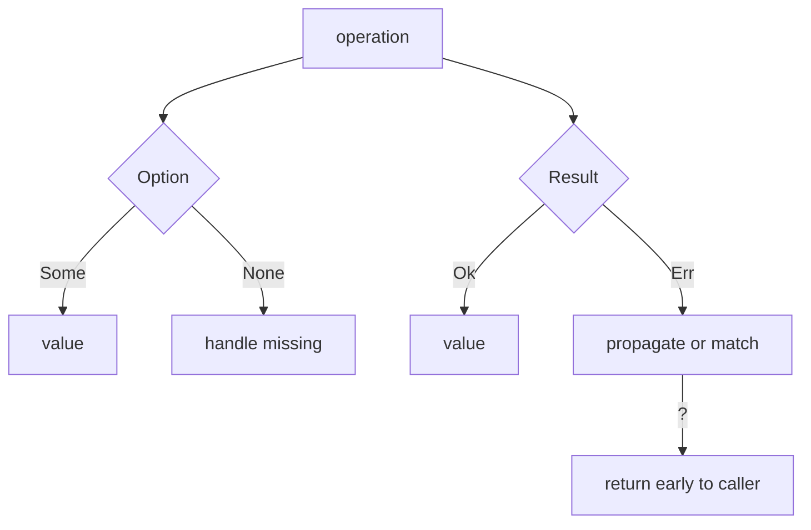

> [!nav] Navigation
> **[[modules/phase-1-rust/02-result-option-errors/Hub|M02 Hub]]** · [[HOME|Home]] · [[learning-progress|Progress]] · [[modules/Index|All modules]] · _you are here: Theory_

# M02 — Result, Option & Errors

**Phase:** 1 | **Prereq:** M01 gate | **Unlocks:** M03

## Objectives

- `Option<T>` = nullable without null pointer bugs
- `Result<T, E>` = expected failure as type
- `?` propagation — early return ergonomics
- `match` / `if let` for control flow
- No `unwrap()` in service code paths

## Visual map

> [!abstract] Draw this first
> Do vertical paths: success green down, error red sideways.

| Type | Visual shape | Payment analog |
|------|--------------|----------------|
| Option | Y fork missing branch | optional fee_payer |
| Result | Y fork failure branch | PSP success/decline |
| ? | elevator up | bubble to controller |

**Sketch gate:** trace `fetch()?.parse()?` as arrows on paper.

## Theory

### Option

`Some(v)` | `None` — size = `T` + 1 byte discriminant (optimized niche).

Payment map: optional `fee_payer` field — DB nullable column jaisa, but compiler forces handle.

### Result

`Ok(v)` | `Err(e)` — RPC call, parse, DB write = sab `Result`.

**Numbers:** indexer 1M msgs/day — 0.1% parse fail = 1000 errors; `unwrap` = 1000 panics = process dead.

### `?` operator

`let x = risky()?` — Err branch pe return from function. Caller signature must return `Result`.

### Error types

Start with `Box<dyn std::error::Error>` or `anyhow` later; abhi `std::io::Error` / custom enum enough.

## Gate

- [ ] G02: refactor unwrap chain to `?`
- [ ] Explain-back: kab `Option` vs `Result`
- [ ] R05–R07 at L2+

## Weakness: `W-error-handling`
