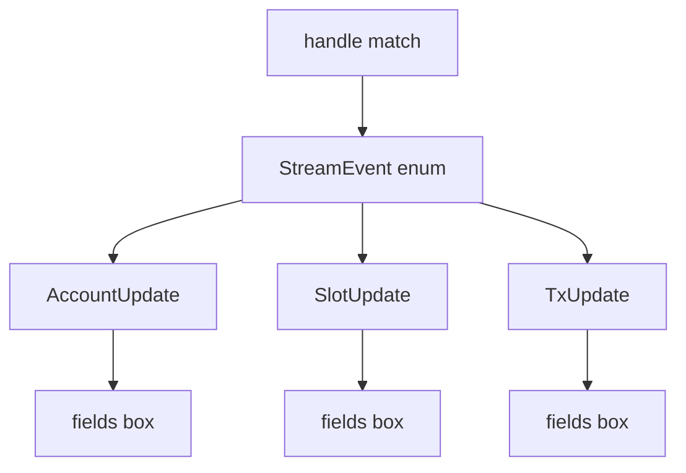
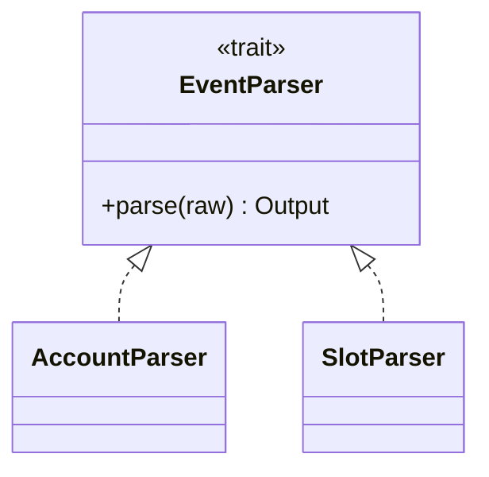

> [!nav] Navigation
> **[[modules/phase-1-rust/03-structs-enums-traits/Hub|M03 Hub]]** · [[HOME|Home]] · [[learning-progress|Progress]] · [[modules/Index|All modules]] · _you are here: Theory_

# M03 — Structs, Enums & Traits

**Phase:** 1 | **Prereq:** M01, M02 | **Unlocks:** M04

## Objectives

- Struct: named account/state shapes
- Enum: instruction variants, tagged unions
- `impl` blocks methods
- Traits: shared behavior (`Debug`, custom parse trait)
- Derive macros: what they generate (conceptually)

## Visual map

> [!abstract] Draw this first
> Enum = tree root with branches. Struct = labeled box.





**Sketch gate:** apne G03 event enum ka tree draw karo.

## Theory

### Struct
Account data layout = struct with fixed fields. **Padding/discriminator** baad mein Anchor — abhi plain Rust.

### Enum
```rust
enum Ix { Transfer { amount: u64 }, Close }
```
Solana instruction = enum discriminant + Borsh payload (M10).

### Traits
`trait Parse { fn parse(data: &[u8]) -> Result<Self, ...>; }` — indexer parsers.

### Derive
`#[derive(Debug, Clone, PartialEq)]` — boilerplate auto.

## Gate

- [ ] G03: model 2 instruction types as enum + `impl` dispatch
- [ ] R08–R10 L2+

## Weakness: `W-types`
