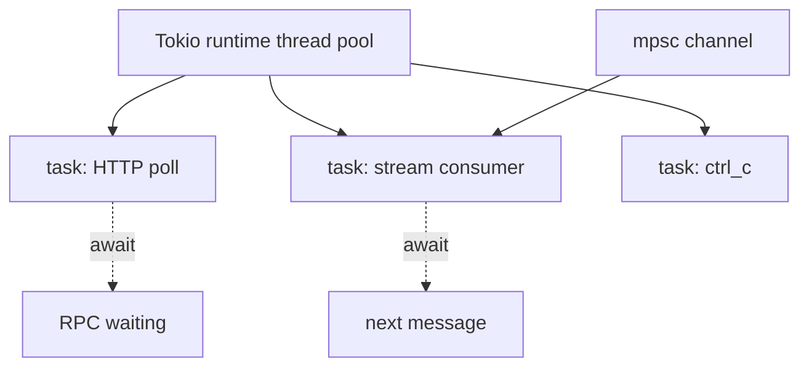

> [!nav] Navigation
> **[[modules/phase-1-rust/04-async-tokio-grpc/Hub|M04 Hub]]** · [[HOME|Home]] · [[learning-progress|Progress]] · [[modules/Index|All modules]] · _you are here: Theory_

# M04 — Async, Tokio & gRPC Client

**Phase:** 1 | **Prereq:** M01–M03 | **Unlocks:** Phase 2 (P1 gate)

## Objectives

- `async fn` = state machine, not new OS thread
- `tokio::spawn`, `join!`, `select!` basics
- Channels for producer/consumer
- Write minimal HTTP client with `reqwest` (gRPC prep)
- Read Yellowstone client code without fear

## Visual map

> [!abstract] Draw this first
> 1 thread, many tasks — waiting = dashed, running = solid.

| Symbol | Meaning |
|--------|---------|
| Solid box | running task |
| Dashed | awaiting I/O |
| Queue | backpressure point |

**Sketch gate:** G04 architecture — 3 boxes + arrows before code.

## Theory

### Async
1 task waiting on RPC = cheap. 10k blocking threads = death.

**Numbers:** 50ms RPC RTT, 100 concurrent fetches — blocking thread pool vs async tasks memory order-of-magnitude difference (MB vs KB per wait).

### Tokio runtime
`#[tokio::main]` — executor drives futures.

### Streams
`StreamExt::next()` — Yellowstone = infinite stream (M13 preview).

### gRPC
Protobuf over HTTP/2 — `tonic` later; abhi mental model: typed RPC, long-lived subscribe.

## P1 gate (Phase 1 capstone)

- [ ] G04: tokio service — fetch URL every N sec, log status, graceful Ctrl+C
- [ ] Explain async vs thread for indexer
- [ ] R11–R13 L2+

## Weakness: `W-async`

## Toolchain

`cargo add tokio reqwest` in learner project.
