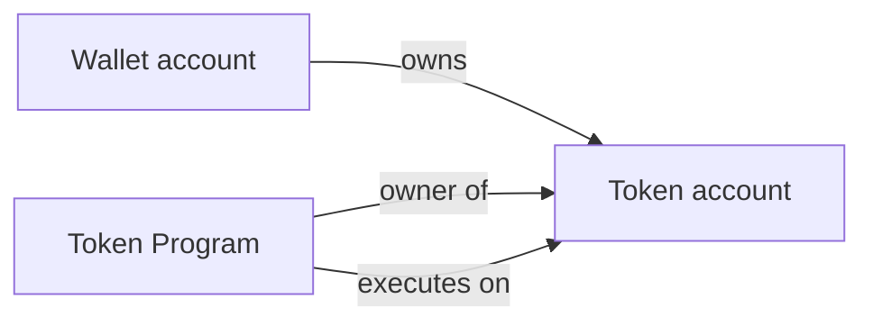

> [!nav] Navigation
> **[[modules/phase-2-solana/01-account-model/Hub|M05 Hub]]** · [[HOME|Home]] · [[learning-progress|Progress]] · [[modules/Index|All modules]] · _you are here: Theory_

# M05 — Solana Account Model

**Phase:** 2 | **Prereq:** P1 gate | **Unlocks:** M06, M07

## Objectives

- Everything is an account (data + lamports + owner + executable flag)
- Programs are stateless; state lives in accounts
- Account types: system, token, program, program-owned data
- Rent-exempt threshold intuition

## Visual map

> [!abstract] Draw this first
> Har cheez ek box. Program box ke andar state NAHI — alag data boxes.

### Account = ek box

```
┌─────────────────────────────────────┐
│ Account pubkey (address)              │
├─────────────────────────────────────┤
│ lamports: 2_500_000_000               │
│ owner: Tokenkeg...  ←── program ID    │
│ executable: false                     │
│ data: [ 165 bytes layout... ]         │
└─────────────────────────────────────┘
```



❌ Program ke andar balance  
✅ Token account ke **data bytes** mein balance

**Sketch gate:** wallet → token account → mint triangle from memory.

## Theory

### Account layout (conceptual)
- **lamports:** balance (1 SOL = 1_000_000_000 lamports)
- **data:** byte[] — max ~10MB (practical much smaller)
- **owner:** program pubkey that can mutate data
- **executable:** program vs data account

**Numbers:**
- System account empty: ~0.00089 SOL rent-exempt ballpark (varies by size)
- Token account: 165 bytes typical
- Program binary: hundreds of KB on-chain

### Mental model fix
❌ "Token program stores my balance"  
✅ "Token program owns token accounts; balance field unke data mein"

**Backend map:** Account = row with owner FK to program table. Program = stored procedure, not row storage.

## Gate

- [ ] Draw account struct on paper from memory
- [ ] G05: label 3 account types from descriptions
- [ ] R14–R16 L2+

## Weakness: `W-account-model`

## Toolchain

`solana account <pubkey>` on devnet — optional observe
