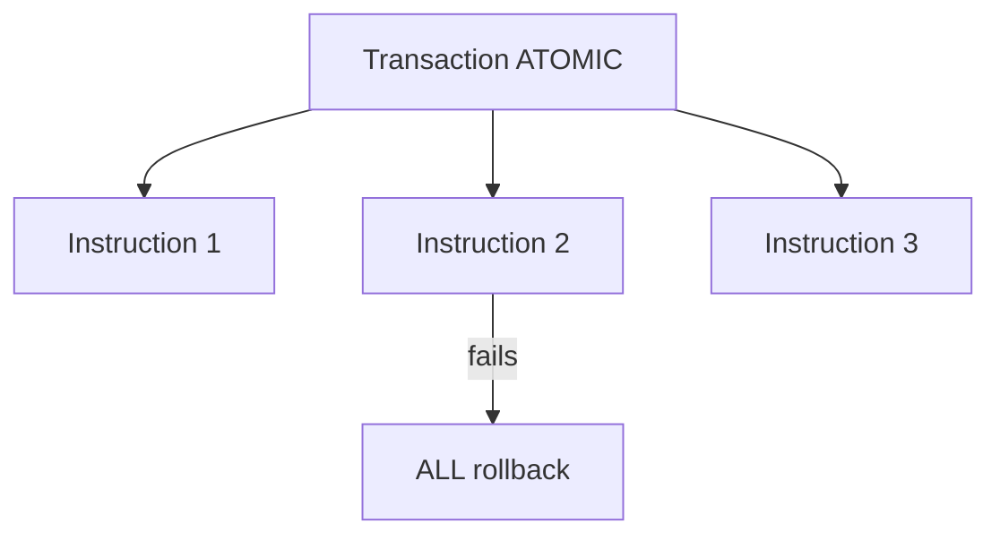

> [!nav] Navigation
> **[[modules/phase-2-solana/02-transactions-instructions/Hub|M06 Hub]]** · [[HOME|Home]] · [[learning-progress|Progress]] · [[modules/Index|All modules]] · _you are here: Theory_

# M06 — Transactions & Instructions

**Phase:** 2 | **Prereq:** M05 | **Unlocks:** M07, M08

## Objectives

- Transaction = atomic batch of instructions
- Instruction = program_id + accounts meta + data
- Signers vs writable accounts
- Message layout (legacy vs v0 brief)
- Fee payer, recent blockhash

## Visual map

> [!abstract] Draw this first
> Tx = outer box. Andar instructions stack. Har instruction = program + account list.

```
Transaction
├── recent_blockhash: abc123...  (TTL ~60-90s)
├── fee_payer: SIGNER ✍
├── signatures: [ ... ]
└── instructions[]
    ├── [0] Transfer: System Program
    │       accounts: [from ✍ writable, to writable]
    └── [1] Memo: Memo Program
            accounts: [signer ✍]
```



**Sketch gate:** G06 transfer — boxes + ✍/writable flags, no code.

## Theory

### Atomicity
3 instructions in 1 tx — sab succeed ya sab fail (unless CPI partial semantics — skip deep).

**Numbers:** typical tx fee ~5000 lamports base + priority; 1232 bytes legacy size limit.

### Account metas
Each account: `is_signer`, `is_writable`. Order matters for hardware wallet display.

### Blockhash
Recent blockhash = TTL ~60-90s — tx invalid after expiry (M16).

**Backend map:** Tx = saga with all-or-nothing steps. Blockhash = idempotency key TTL.

## Gate

- [ ] G06: build account metas list for transfer (paper)
- [ ] R17–R19 L2+

## Weakness: `W-tx-layout`
