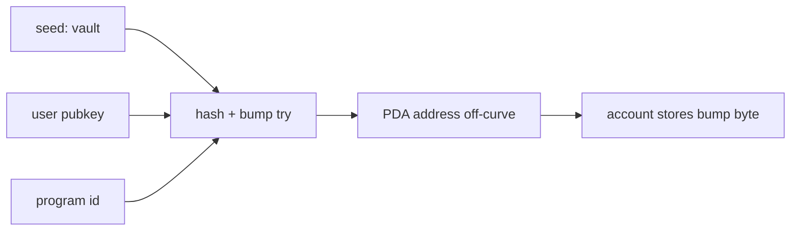

> [!nav] Navigation
> **[[modules/phase-2-solana/03-pdas-rent-lamports/Hub|M07 Hub]]** · [[HOME|Home]] · [[learning-progress|Progress]] · [[modules/Index|All modules]] · _you are here: Theory_

# M07 — PDAs, Rent & Lamports

**Phase:** 2 | **Prereq:** M05, M06 | **Unlocks:** M08, M10

## Objectives

- PDA derivation: seeds + bump, off-curve
- Program signs with `invoke_signed`
- Rent-exempt calculation intuition
- When to use PDA vs keypair account

## Visual map

> [!abstract] Draw this first
> Seeds go in blender → PDA address out. No private key.



```
Rent-exempt deposit (locked SOL)
┌──────────────────┐
│ data_size bytes  │ ──► lamports ≥ rent_min(size)
│ 165 token acct   │     ~0.002 SOL order
└──────────────────┘
```

**Sketch gate:** seed list + arrow to PDA + where bump lives.

## Theory

### PDA
`find_program_address(seeds, program_id)` → (pubkey, bump). No private key.

**Use cases:** vault, escrow, per-user state account authority.

### Seeds
Common: static string, user pubkey, mint pubkey — **canonical order** matters.

### Rent
`rent-exempt = f(data_size)` — one-time deposit, not monthly AWS bill — but space costs SOL locked.

**Numbers:** 1 SOL = 1e9 lamports. PDA bump stored in account data often (Anchor `#[account(bump)]`).

## Gate

- [ ] G07: derive PDA on paper given seeds (agent verifies logic)
- [ ] R20–R22 L2+

## Weakness: `W-pda`
