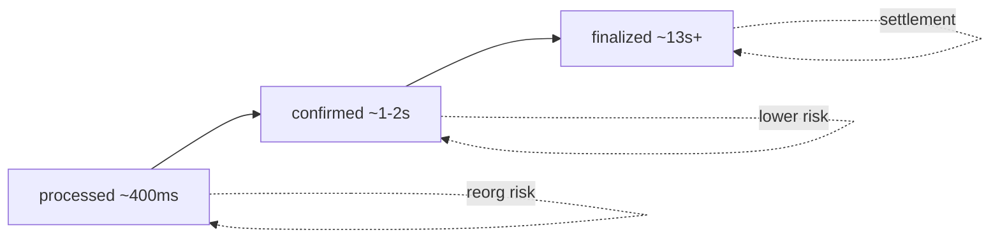

> [!nav] Navigation
> **[[modules/phase-2-solana/04-commitment-compute/Hub|M08 Hub]]** · [[HOME|Home]] · [[learning-progress|Progress]] · [[modules/Index|All modules]] · _you are here: Theory_

# M08 — Commitment & Compute Budget

**Phase:** 2 | **Prereq:** M06 | **Unlocks:** P2 gate, M16

## Objectives

- processed / confirmed / finalized semantics
- Slot time ~400ms, finality ~13s (network dependent)
- Compute units (CU) and priority fees
- When indexer vs tx service uses which commitment

## Visual map

> [!abstract] Draw this first
> Horizontal timeline left=fast right=safe.



```
Compute budget per tx
┌─────────────────────────────┐
│ default ~200_000 CU         │
│ priority fee = micro-lamports/CU │
│ exceed CU → tx FAIL ✗        │
└─────────────────────────────┘
```

| Use case | Mark on timeline |
|----------|------------------|
| UI sparkle | processed |
| Indexer head | confirmed |
| Reconciliation | finalized |

**Sketch gate:** 5 scenarios ko timeline pe dot lagao.

## Theory

### Commitment ladder
| Level | Rough latency | Reorg risk | Use |
|-------|---------------|------------|-----|
| processed | ~400ms | higher | UI hints, dangerous for settlement |
| confirmed | ~1-2s | lower | many indexers |
| finalized | ~13s+ | minimal | reconciliation, withdrawals |

**Backend map:** processed = cache; finalized = committed ledger.

### Compute budget
Default ~200k CU per tx. Exceed = fail entire tx. Priority fee = micro-lamports per CU.

## P2 gate

- [ ] G08: pick commitment per scenario (indexer head, user balance UI, settlement)
- [ ] Explain reorg at confirmed vs finalized
- [ ] R23–R25 L2+

## Weakness: `W-commitment`
