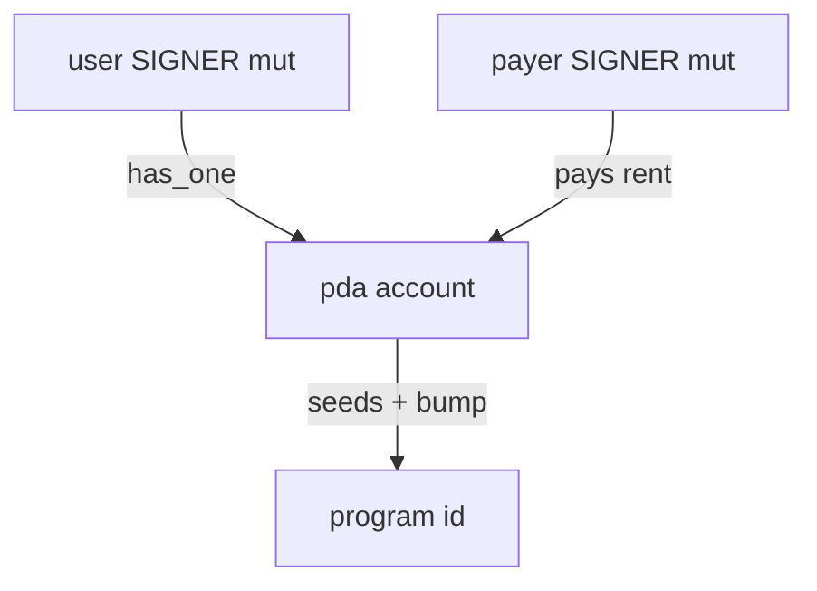

> [!nav] Navigation
> **[[modules/phase-3-anchor/02-accounts-constraints-idl/Hub|M10 Hub]]** · [[HOME|Home]] · [[learning-progress|Progress]] · [[modules/Index|All modules]] · _you are here: Theory_

# M10 — Accounts, Constraints & IDL

**Phase:** 3 | **Prereq:** M09 | **Unlocks:** M11

## Objectives

- `#[account(...)]` constraints: init, mut, seeds, bump, has_one, constraint =
- Account discriminator (8 bytes Anchor prefix)
- IDL JSON: instructions, accounts, types for clients/indexers
- Client-side account resolution from IDL

## Visual map

> [!abstract] Draw this first
> Accounts = nodes. Constraints = edges with labels.



```
IDL = OpenAPI for chain
┌─────────────┐     ┌──────────────┐
│ instructions│     │ accounts     │
│ types       │ ──► │ TypeScript   │
│ metadata    │     │ Rust client  │
└─────────────┘     └──────────────┘
```

**Sketch gate:** G10 accounts struct as labeled graph.

## Theory

### Common constraints
| Constraint | Meaning |
|------------|---------|
| `mut` | writable, balance change allowed |
| `signer` | must sign tx |
| `init` | create account, payer pays rent |
| `seeds` + `bump` | PDA validation |

**Numbers:** 8-byte discriminator + serialized fields = account data size → rent.

### IDL
Off-chain: `@coral-xyz/anchor`, Rust `anchor-lang` client, Carbon parsers — all consume IDL shape.

**Backend map:** IDL = OpenAPI for on-chain API.

## Gate

- [ ] G10: explain every constraint on your target program's one Accounts struct
- [ ] R27 L2+

## Weakness: `W-anchor-accounts`
