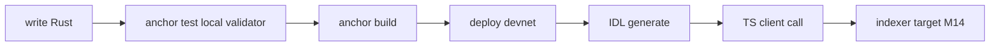

> [!nav] Navigation
> **[[modules/phase-3-anchor/03-write-small-program/Hub|M11 Hub]]** · [[HOME|Home]] · [[learning-progress|Progress]] · [[modules/Index|All modules]] · _you are here: Theory_

# M11 — Write a Small Program

**Phase:** 3 | **Prereq:** M10 | **Unlocks:** P3 gate, Phase 4

## Objectives

- `anchor init` → build → test → deploy devnet
- Write 2–3 instructions (e.g. counter or simple escrow record)
- Generate IDL, call from TS client
- Something **you will index** in M14

## Visual map

> [!abstract] Draw this first
> Local → test → devnet pipeline.

**Sketch gate:** apne program ke 2 instructions + accounts boxes.

## Suggested program: `event_log`

- `initialize_log` — PDA per user, stores count
- `append_event` — increment + emit event (or store hash)
- Forces: PDA seeds, mut, signer, small account data

**Numbers:** account ~8 + 32 + 8 bytes → rent ~0.002 SOL ballpark.

## P3 gate

- [ ] G11: deployed devnet program ID in learning-progress
- [ ] IDL committed to repo
- [ ] TS script calls one ix successfully
- [ ] Explain every account in one ix
- [ ] R28 L2+

## Weakness: combines W-pda, W-anchor-accounts
