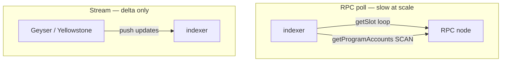

> [!nav] Navigation
> **[[modules/phase-4-backend/01-rpc-vs-streaming/Hub|M12 Hub]]** · [[HOME|Home]] · [[learning-progress|Progress]] · [[modules/Index|All modules]] · _you are here: Theory_

# M12 — RPC vs Streaming

**Phase:** 4 | **Prereq:** P3 gate | **Unlocks:** M13, M16

## Objectives

- JSON-RPC methods: `getSlot`, `getBlock`, `getTransaction`, `getProgramAccounts`
- Polling vs push; latency & rate limits
- Why `getProgramAccounts` doesn't scale
- When RPC is correct tool (backfill, one-off, tx submit)

## Visual map

> [!abstract] Draw this first
> Left = pull ladder. Right = push river.

| Pattern | Visual | Scale |
|---------|--------|-------|
| GPA scan | magnifying glass on ALL rows | O(all accounts) ✗ |
| Stream filter | tap on pipe | O(changes) ✓ |

**Sketch gate:** G12 — two paths diagram for your program.

## Theory

### RPC
Request/response over HTTP. Typical 10–50ms LAN, 100–300ms public.

**Numbers:** public RPC ~100 req/s tier limits; 50k accounts GPA scan = seconds + huge payload.

### Streaming (preview M13)
Yellowstone pushes account/tx updates — O(new changes) not O(all state).

**Backend map:** RPC = REST poll; Geyser = Kafka topic with chain events.

### Patterns
| Need | Tool |
|------|------|
| Submit tx | RPC `sendTransaction` |
| Historical gap fill | RPC `getBlock` range |
| Live indexer head | Yellowstone |
| Wallet balance refresh | RPC or stream filter |

## Gate

- [ ] G12: architecture pick for 3 product requirements
- [ ] R29 L2+

## Weakness: `W-streaming`
