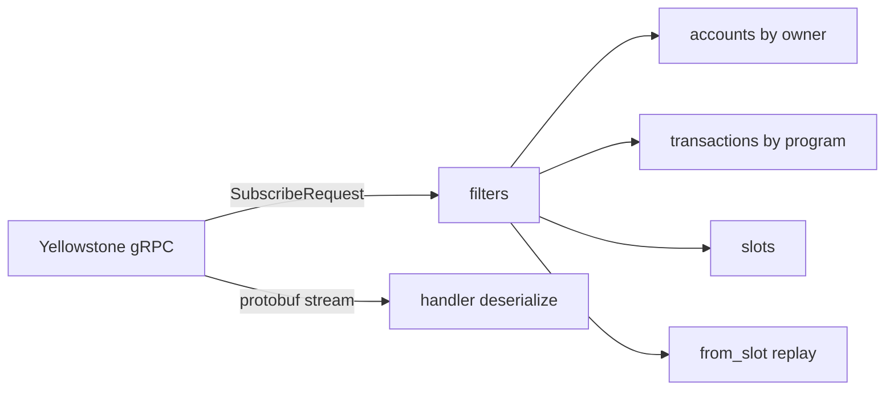

> [!nav] Navigation
> **[[modules/phase-4-backend/02-yellowstone-grpc/Hub|M13 Hub]]** · [[HOME|Home]] · [[learning-progress|Progress]] · [[modules/Index|All modules]] · _you are here: Theory_

# M13 — Yellowstone gRPC

**Phase:** 4 | **Prereq:** M12 | **Unlocks:** M14, M15

## Objectives

- Subscribe request: accounts, transactions, slots, blocks
- Filters: `account`, `owner`, `memcmp`, `vote`, `failed`
- `from_slot` replay; commitment in subscribe
- Protobuf payloads; deserialize tx/account updates
- Parse instruction data with IDL/discriminator

## Visual map

> [!abstract] Draw this first
> Subscribe box with filters flowing out.



```
Disconnect recovery
  last_slot=105 → reconnect from_slot=106 → gap fill RPC
```

**Sketch gate:** filter diagram for your M11 program id.

## Theory

### Subscribe shape (conceptual)
```
SubscribeRequest {
  slots: { ... },
  accounts: { map key -> AccountFilter },
  transactions: { ... },
  commitment: Confirmed,
  from_slot: optional
}
```

### Filters
Program owner filter → all accounts owned by program — still need client-side ix parse.

**Numbers:** devnet stream may be quieter; mainnet 3k+ TPS peaks — handler must not block (async).

### Replay
`from_slot` = Kafka `auto.offset.reset` + gap fill — if disconnect, resume slot.

## Gate

- [ ] G13: live subscribe to your program, log 5 events with slot
- [ ] R30 L2+

## Toolchain

Hosted Yellowstone endpoint (Helius/Triton/Shyft) — API key in env, not committed.

## Weakness: `W-streaming`, `W-indexer` (early)
