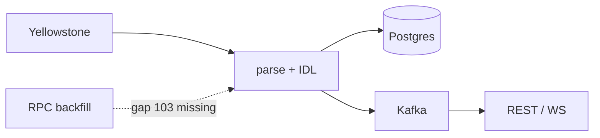

> [!nav] Navigation
> **[[modules/phase-4-backend/03-indexer-node/Hub|M14 Hub]]** · [[HOME|Home]] · [[learning-progress|Progress]] · [[modules/Index|All modules]] · _you are here: Theory_

# M14 — Indexer (Node/TypeScript)

**Phase:** 4 | **Prereq:** M13 | **Unlocks:** M15, M17

## Objectives

- Pipeline: Yellowstone → parse → Postgres → Kafka → API/ws
- Schema: slots, transactions, accounts, parsed_events
- Gap-free ingestion: track `last_processed_slot`
- Dedup: signature + ix index unique keys
- Reorg: confirmed head rollback strategy
- Backfill worker: RPC `getBlock` for gaps
- Failover: multiple consumers, leader election or partition key

## Visual map

> [!abstract] Draw this first
> Pipeline left to right. Gap = broken chain link.



```
Slot chain (gap-free)
  100 — 101 — [102 MISSING] — 103
              ↑
         backfill worker
```

**Sketch gate:** full pipeline + dedup key label.

## Theory

### Slot monotonicity
Store `max(slot)` but handle same slot multiple updates — idempotent upserts.

**Numbers:** slot ~400ms → ~2.5 slots/s. Gap of 10 slots ≈ 4s behind — backfill priority.

### Dedup
`UNIQUE(signature, ix_index)` or event id hash.

### Reorg
Confirmed head moves back — mark events `tombstoned` or `status=reverted` past N slots.

**Backend map:** exactly-once illusion = idempotent consumer + dedup store (you know this — connect dots).

## Gate

- [ ] G14: indexer runs 1h on devnet, Postgres has parsed events, gap injected once and healed
- [ ] R31 L2+

## Weakness: `W-indexer`
